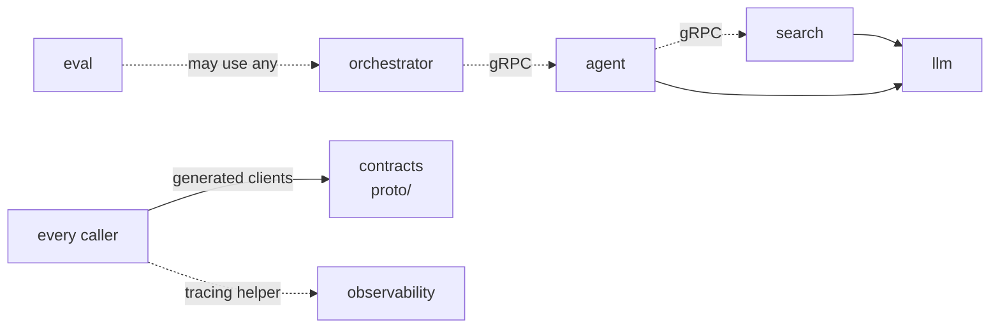

# CLAUDE.md

## What this is

A monorepo: one directory per service or library, building a personal backend for Open WebUI.

**Each directory is a separate project.** It has its own `pyproject.toml`, `uv.lock`, `.venv`,
`justfile`, tests, README and `docs/`. Treat it that way:

- Work inside one project at a time. Run `uv`, `pytest` and `just` from that project's directory
  (or `just <service> <recipe>` from the root), never across projects.
- A project uses another only through a declared dependency: a `[tool.uv.sources]` path
  dependency on a library (`llm`, `common`, `observability`, `contracts`) or a network contract.
  Never import an undeclared sibling, and never read or write another project's files.
- **Services talk only through generated gRPC clients.** Every service's interface is a `.proto`
  in `proto/src/contracts/<service>/v1/`. Callers import `contracts` (`proto/`) and never import
  another service's project. Never write the interface by hand in Python (pydantic or dataclass
  copies of a contract). After editing a `.proto`, run `just proto generate` and commit the
  generated code. See `docs/decisions/0005-grpc-generated-clients.md`.
- **The client for an internal service is a Python wrapper around the proto-generated client.**
  It lives in `proto/src/contracts/<service>/client.py` (e.g. `contracts.search.SearchClient`,
  `contracts.agent.AgentClient`), holds the generated stub (`<Service>Stub` from
  `<service>_pb2_grpc`) and calls it. Everything is set through the constructor:
  `Client(address=None, *, timeout=..., interceptors=[...], options=[...])` (address default from
  `<SERVICE>_ADDRESS`; `options` are gRPC channel options over `DEFAULT_CHANNEL_OPTIONS`). The
  wrapper stays thin: it only fills in the address, the deadline and the request message, and binds
  each RPC with `contracts.interceptors.bind(stub, SERVICE, "<Method>", interceptors)`. It takes and
  returns the generated messages as they are (no dataclass or dict copies) and lets the stub's
  `grpc.RpcError` through; each caller maps errors to its own `ServiceFault` where it models them.
  A caller-specific adapter (e.g. the orchestrator's `AgentBackend`) wraps this wrapper, never the
  stub directly. A new internal service gets its `.proto`, generated code and wrapper in the same
  change.
- **Cross-cutting call behaviour is an interceptor**, written against our request/response
  interface in `contracts/interceptors.py`, not gRPC's interceptor API: a class with
  `intercept(request: Request, proceed: Handler) -> Response`, where `Request` carries `method`,
  `message`, `timeout`, `metadata` and `streaming` (change it with `request.replace(...)`), and the
  response is the generated message (or an iterator of them for a streaming RPC). Callers pass
  interceptors to the wrapper's constructor; `TraceContext` is always first. Built in: `Retry`
  (on UNAVAILABLE, with backoff; a stream only before its first message). **Retries are used only
  for calls to the search service** (`build_graph` in `agent/src/agent/graph.py`): a search is
  read-only, while a retried agent `Run` pays for its model calls again. Test wrappers and
  interceptors against an in-process gRPC server (`proto/tests/test_clients.py`), and a client a
  service builds with interceptors in that service's tests (e.g. `agent/tests/test_search_retry.py`).
- A change to one project's public API or contract means checking every project that depends on
  it and updating those in the same change.

All the projects together provide one feature: the backend Open WebUI talks to. `webui/` runs
Open WebUI, which calls `orchestrator/` (OpenAI-compatible API), which calls the `agent/` service
(gRPC), which retrieves through the `search/` service (gRPC) and calls models through `llm/`; every service traces to
`observability/`. Judge a change by whether that end-to-end chat still works, not only by the
project's own tests.
Read `README.md`, then `docs/architecture.md` and `docs/conventions.md`, before working here.
Ideas and open decisions are in `plan.md`. Check the README of the service you are working in.

## Scope: code and the system's own documentation

Allowed here: code, tests, and documentation about this system:

- `README.md` at the root and in each service.
- `docs/` at the root (cross-cutting) and in each service (contract, config, runbook).
- ADRs in `decisions/` directories.
- `plan.md`.
- Generated diagrams (see Diagrams below).

**Learning notes never go here.** Notes about ML concepts, library/API usage, walkthroughs and
debugging gotchas belong in the notes vault outside the repo. Also keep out personal notes,
to-dos, reading notes and career/business topics.

The rule of thumb: if it describes how *this system* works or why it was built that way, it
belongs here. If it teaches something general, it does not.

Docs live next to the code they describe and change in the same edit. Cross-cutting facts live
once in the root `docs/`; service docs link to them instead of copying.

**Machine requirements** (Docker, `just`, any tool that must be installed to run something) are
recorded in `docs/requirements.md`. When a change adds a new tool dependency, add it there in the
same edit: the tool, what needs it, why, and the install command.

## Diagrams: Mermaid only (hard requirement)

Every diagram in this repo, in any `.md` file, is a ```` ```mermaid ```` fenced block. Never
draw diagrams as ASCII art, arrows in plain code blocks, images or other formats. This applies
to flows, sequences, dependency graphs and state machines, in READMEs, `docs/`, ADRs and
`plan.md`. When editing a file that has a non-Mermaid diagram, convert it. Plain directory
listings of files are not diagrams and may stay as code blocks.

## Layout and rules

- Directories: `llm/` (model client, OpenRouter), `search/`, `agent/`, `orchestrator/`,
  `proto/` (the `contracts` package: `.proto` files, the gRPC code generated from them, client
  wrappers), `webui/` (Docker config for Open WebUI), `observability/`, `eval/`, `integration_tests/` (smoke test of the running stack), `common/` (values and helpers shared by every service, e.g. the
  `Stage` enum), `scripts/` (bash helpers the justfiles call to start, wait for and stop
  services; recipes stay thin and put shell logic there).
- Dependencies point one way (see the diagram below); `eval` may use any; every service uses
  the telemetry helper in `observability/` (`setup_telemetry`). Telemetry is described in
  `docs/telemetry.md`: measure new operations with `operation(...)` (or only a function's run
  time with `@timed(name)`), raise a `ServiceFault` subclass for a modelled failure (counted as a
  fault) and `UserError` for the caller's mistake (an error); anything else counts as a failure.
  Update `docs/telemetry.md` and `observability/grafana/dashboard.py` in the same change when
  operations change.
- Only `llm/` talks to model providers.
- Shared values live once in `common/` (enums, not magic strings); any service may import it.
- Every project logs through `common.log` (`common/README.md`), never the `logging` module
  directly: `log = get_logger("<service>.<module>")` in a module, and `setup_logging("<service>")`
  once in a service's entry point (its `__main__`, or the app module a dev server imports). Never
  call `logging.basicConfig`, `logging.getLogger` or add handlers; libraries (`llm`, `agent`,
  `observability`) only call `get_logger`. A server run by uvicorn passes `log_config=None`. Each
  service writes `logs/<service>.app.<creation time>.log` at the root, rolled every `LOG_ROLL_MINUTES` (default 60) and by size;
  `logs/<service>.log` points to the current file. Every log file name matches
  `<service>.<stream>.<time>.log` (`common.log.FILE_NAME`; stream `app` or `console`), so the
  log cleaner (`common.log_cleaner`, started by `just up`) can delete old ones. A new project that logs adds `common` as a
  path dependency.



- Configuration and secrets come from environment variables, never the repo.
- The notes vault (`SEARCH_VAULT_PATH`) is read-only for everything in this repo.

Generated diagrams (e.g. LangGraph graphs) go in a `.md` file with a ```` ```mermaid ````
fenced block, e.g. `agent/graph.md`.
