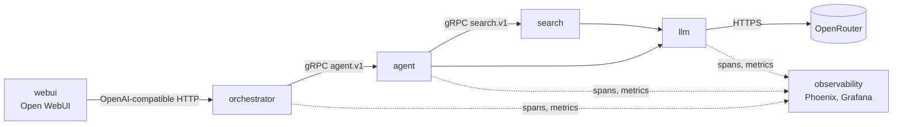
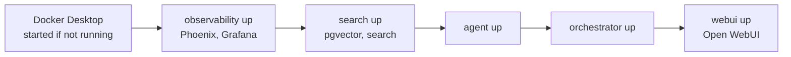

# ml

A personal backend for Open WebUI. It answers a query directly, or retrieves from my Obsidian
notes when it needs to, and loops until verifiers judge the answer good enough. Every request is
traced, so both the answer and the road to it can be evaluated.

**Your notes:** search reads a folder of Markdown (`.md`) notes, such as an Obsidian vault. Set
`SEARCH_VAULT_PATH` to that folder and `SEARCH_COLLECTIONS` to the subfolders to index (see
[`search/README.md`](search/README.md#function)). The eval datasets that check facts in notes
(`eval/datasets/vault_facts.jsonl`, `grounding.jsonl`) assume the author's notes, so replace them
with facts from your own.

See `plan.md` for the ideas and open decisions.

## Services

Each directory is a separate project. It has its own `pyproject.toml`, `uv.lock` and virtualenv,
its own `justfile`, tests, README and `docs/`. Work in one project at a time, and run its tests
from its own directory (`just <service> test` from the root). A project uses another only through
a declared dependency (a `[tool.uv.sources]` path dependency or a network contract), never by
reaching into its files.

Together the projects make up one thing: the backend behind Open WebUI. A chat in the browser
goes through them like this:



Service-to-service calls are gRPC, made through clients generated from the `.proto` contracts
in `proto/` ([ADR 0005](docs/decisions/0005-grpc-generated-clients.md)); no service imports
another. `common/` is imported by any project. `eval/` runs datasets end to end through the orchestrator
(`OrchestratorClient`), from outside the request path. Which arrows are imports and which are
network calls: `docs/architecture.md`.

| Directory | Function |
|---|---|
| `llm/` | Provider-agnostic client for chat, streaming and embeddings (OpenRouter; embeddings move to a local ONNX model, see `plan.md`) |
| `search/` | Ingest Obsidian notes, embed them, store in pgvector, answer queries over gRPC |
| `agent/` | Plan → Act → Observe → Reflect loop (LangGraph) with pluggable verifiers, served over gRPC |
| `proto/` | The service contracts (`.proto`), the gRPC code generated from them and thin client wrappers (Python package `contracts`) |
| `orchestrator/` | The OpenAI-compatible backend Open WebUI connects to |
| `webui/` | Docker config that runs Open WebUI against the orchestrator |
| `common/` | Values and helpers every service shares: the `Stage` enum, loading `.env` in development |
| `observability/` | Phoenix (`phoenix/`) and Grafana (`grafana/`) servers, and the shared telemetry helper (`setup_telemetry`) |
| `integration_tests/` | Smoke test of the running system: questions to the orchestrator, sensible answers back |
| `eval/` | Datasets, evaluators and a runner that records Phoenix experiments; scores outcome and process together |
| `scripts/` | Bash helpers the justfiles call to start, wait for and stop services (not a project) |

## Setup

On a fresh clone (macOS, needs [Homebrew](https://brew.sh), `brew install just uv`, and an
`OR_KEY`; see `docs/requirements.md`):

```
just setup              # install Docker Desktop if missing
just up                 # start the stack: Phoenix, search, agent, orchestrator, Open WebUI (http://localhost:3000)
just down               # stop it all, then quit Docker Desktop; volumes and data are kept
just                    # list every recipe, including the service modules
```

Service recipes run from the root as `just <service> <recipe>`, for example `just webui up` or
`just llm test`.

## Running the stack

Each service's `justfile` is a module of the root one (`mod <service>`), and its recipes run in
the service's own directory. The root `up` and `down` do no work themselves: they call each
service's `up` and `down`, in dependency order. The service recipes are thin too: the shell
logic (start in the background, wait for a health URL, stop a port) is in the shared
`scripts/`.



`just down` runs the same steps in reverse: webui, orchestrator, agent, search, observability, then
quits Docker Desktop, unless containers from outside this stack are still running. It is safe
when Docker is already off: the Docker steps are skipped and the background servers still
stop.

| Service | Port | Started by | Runs as | Logs |
|---|---|---|---|---|
| Phoenix | 6006 | `just observability up` | Docker | `just observability phoenix logs` |
| Grafana | 3001 (OTLP 4318) | `just observability up` | Docker | `just observability grafana logs` |
| pgvector | 5433 (`SEARCH_DB_PORT`) | `just search up` (`db-up`) | Docker | `just search db-logs` |
| search (gRPC) | 8001 | `just search up` | background process | `logs/search.log` |
| agent (gRPC) | 8002 | `just agent up` | background process | `logs/agent.log` |
| orchestrator | 8000 | `just orchestrator up` | background process | `logs/orchestrator.log` |
| Open WebUI | 3000 | `just webui up` | Docker | `just webui logs` |

- Every `up` waits until its service answers, so the next one can rely on it. The first search
  start syncs the whole vault before serving and can take minutes.
- `up` is safe to run again: a service that is already serving its port is skipped.
- `down` keeps the Docker volumes, so traces,
  vectors and Open WebUI's chats survive.
- The orchestrator started by `up` does not reload on code changes. While editing it, run
  `just orchestrator down`, then `just orchestrator dev`.
- Every service logs through `common.log` to `logs/<service>.app.<creation time>.log` at the
  root, rolled every hour (`LOG_ROLL_MINUTES`) and at 50 MB (`LOG_MAX_MB`); `logs/<service>.log` is a symlink to the current file
  (`tail -F logs/search.log`). A background server's raw output (e.g. a crash at startup) is in
  `logs/<service>.console.<creation time>.log`, linked from `logs/<service>.console.log`.
  `logs/` is git-ignored.
- `just up` also starts the log cleaner (`just common log-cleaner-up`), a background process
  that deletes log files older than `LOG_CLEANUP_MAX_AGE_HOURS` (default 24) by the time in
  their name; `just down` stops it. Details: `common/README.md#logging`.

## Monitoring

Every request is measured and traced. Full description: [`docs/telemetry.md`](docs/telemetry.md).

| What | Where |
|---|---|
| Request count, latency, errors, faults, failures | Grafana dashboard **ML operations**: http://localhost:3001/d/ml-operations (admin / admin) |
| One request step by step: prompts, notes, judge scores | Phoenix: http://localhost:6006, project `ml` |

Outcomes: **error** is the caller's mistake (4xx), **fault** a modelled service failure (a
dependency down or timing out), **failure** anything unplanned (a bug).

## Reading order

1. `docs/architecture.md`: how the services fit together.
2. `docs/conventions.md`: layout, testing, config, dependency rules.
3. [`docs/telemetry.md`](docs/telemetry.md): metrics, traces, outcomes, the dashboard, and what each service emits.
4. `docs/requirements.md`: tools to install on the machine (Docker, `uv`, `just`) and the OpenRouter key.
5. The README of the service you are working on.

## Notes versus docs

System documentation (architecture, contracts, runbooks, decisions) lives in this repo.
Learning notes about ML concepts live in the notes folder search reads, outside the repo.
