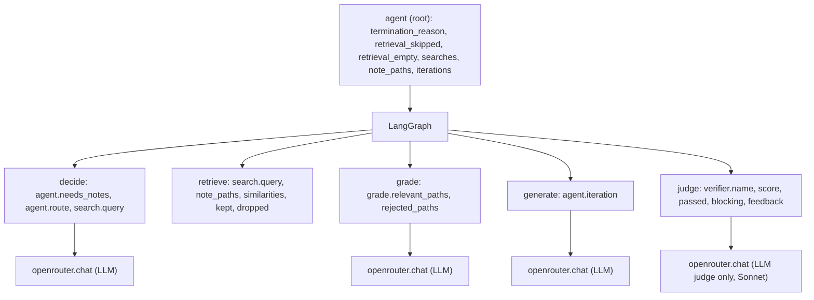

# agent

The Plan → Act → Observe → Reflect loop, built with LangGraph, with pluggable verifiers.

Status: first version, served as the `agent.v1.Agent` gRPC service on port 8002 (`just up`, or
`just run` in the foreground; log in `logs/agent.log`). The contract is
`../proto/src/contracts/agent/v1/agent.proto`; `src/agent/server.py` implements its generated
servicer, and the orchestrator calls it through `contracts.agent.AgentClient`.
`src/agent/graph.py` is a LangGraph
graph (drawn in `graph.md`, regenerate with `uv run python -m agent.graph`):

- **decide:** a classifier: the LLM routes the last message to one note collection and writes the
  search query, or routes it to `none` (greetings, small talk, anything no collection covers).
  Collections are `common.collection.Collection`, described to the LLM in `COLLECTIONS`: `ml` for
  machine-learning questions, `test` only for messages marked as a test question ("Test question:
  what is my favorite number?"), which hold made-up facts for the eval. Unparseable replies and
  unknown routes search every collection. On a retry it also gets the judge's feedback, the
  queries already searched and the notes already found, and may write a new query aimed at what
  is missing (Reflect → Plan).
- **retrieve:** hybrid search through the search service's generated gRPC client
  (`contracts.search.SearchClient`), built with the `Retry` interceptor: a search that fails
  UNAVAILABLE (search restarting) is tried up to 3 times in all (`SEARCH_ATTEMPTS`), with backoff. Results
  with cosine similarity under `AGENT_MIN_SIMILARITY` (0.2) are junk and dropped. That floor is
  not a relevance test: with `text-embedding-3-small` the right note scores 0.22–0.59 and
  wrong-but-close notes overlap that range (measured with `just eval retrieval`). A query already
  searched is not searched again.
- **grade:** the LLM reads the question and the first 1500 characters of each remaining note and
  keeps the notes that help answer it. Kept notes join those from earlier searches. An
  unparseable reply keeps every note.
- **generate:** the LLM answers, with the notes if any, and is told the judge's requirements
  (e.g. "Answer in at most 100 words.") up front. If the notes were searched and none was
  relevant, it is told so and says so in the answer instead of passing general knowledge off
  as grounded. On a retry the conversation also holds each earlier answer (as an assistant
  turn) and the judge's feedback on it (as a user turn, so the request always ends on a user
  message), kept in `State.context`.
- **judge:** a pluggable judge from `src/agent/judges/` scores the answer 0-100 and gives feedback.
  Above 50 ends the run; otherwise back to decide, at most 3 answers. The best-scored answer is
  returned. A judge that cannot judge (unparseable reply, or OpenRouter down) is logged and the
  answer accepted; the run ends with `agent.termination_reason=judge_unavailable`. `AGENT_JUDGE` picks the
  judge, one of the `JudgeName` enum:
  - `llm` (default): `judges/llm.py`, a model scores with a fixed rubric.
  - `word_limit`: `judges/word_limit.py`, plain code. At most 100 words passes; otherwise the
    feedback gives the word count and the limit.
  - `aggregate`: `judges/aggregate.py`, runs `word_limit` then `llm` on the answer. The score is the
    lowest one; the feedback is every non-empty sub-judge feedback, one per line (none if none).
    The `llm` judge is told the word limit, so it does not ask for more detail than fits.

  Each judge lists the rules it enforces as text in `requirements` (`judges/requirements.py`
  formats them as a prompt section). The same text goes into the generate prompt and the LLM
  judge's prompt, so the writer knows a rule before breaking it and the judges do not contradict
  each other.

Models, all through `llm.OpenRouterClient` (`../llm/`), so `OR_KEY` must be set:

| Steps | Model | Set by |
|---|---|---|
| decide, grade, generate | Haiku | `LLM_OPENROUTER_MODEL` |
| the LLM judge | Sonnet (`anthropic/claude-sonnet-5.5`) | `AGENT_JUDGE_MODEL`, one of `llm.openrouter.OpenRouterModel` |

The judge runs on a stronger model than the writer, so it is not grading its own work; Phoenix
shows both model IDs in one trace. A request takes 3 model calls without notes (decide, generate,
judge), 4 with them (plus grade), and 2-3 more per retry.
`Run` (`AgentService` in `server.py`) runs the graph in a background thread and streams a
`Progress` event every 3 seconds while it works, then one `Answer` with the final answer. The
orchestrator turns the progress events into the counter the user sees. Errors become status
codes: a `ServiceFault` (search or OpenRouter down) is UNAVAILABLE, a malformed request
INVALID_ARGUMENT, anything else INTERNAL.

## Configuration

Environment variables; `just` loads `.env` (copy `.env.example`).

| Variable | Purpose |
|---|---|
| `OR_KEY` | Required. Model calls go through OpenRouter (`../llm/`) |
| `LLM_OPENROUTER_MODEL` | The writer's model, default `anthropic/claude-haiku-4.5` |
| `AGENT_PORT` | gRPC port, default `8002` |
| `SEARCH_ADDRESS` | The search service, default `127.0.0.1:8001` |
| `AGENT_JUDGE` | The judge: `llm` (default), `word_limit` or `aggregate` |
| `AGENT_JUDGE_MODEL` | OpenRouter model for the LLM judge, one of `llm.openrouter.OpenRouterModel`. Default `anthropic/claude-sonnet-5.5` |
| `AGENT_MIN_SIMILARITY` | Cosine similarity under which a search result is dropped as junk, before the grade step decides relevance. Default `0.2`; check with `just eval retrieval` |
| `PHOENIX_COLLECTOR_ENDPOINT`, `METRICS_COLLECTOR_ENDPOINT`, `TRACING_ENABLED`, `METRICS_ENABLED` | Telemetry, see `../docs/telemetry.md` |

The design below (Plan → Act → Observe → Reflect, pluggable verifiers) is the target; this
version is its first slice.

## Tracing

Every request is a trace in Phoenix (http://localhost:6006, project `ml`), through the helper in
`../observability/`. `python -m agent` calls `setup_telemetry("agent")` before building the gRPC
server, which also sets up metrics (see Metrics below) and the gRPC server instrumentation: each
`Run` is a `/agent.v1.Agent/Run` span that continues the orchestrator's trace from the call's
metadata. Below it:



- `run()` opens the `agent` root span by hand. The LangChain instrumentation creates the
  LangGraph and node spans; `traced()` in `graph.py` makes each node's span current while it
  runs, so its attributes and the model call spans land on that node.
- Model calls bypass LangChain, so `OpenRouterClient` (`../llm/`) opens the LLM span itself:
  the model OpenRouter used, prompt, reply, token counts and billed cost (`llm.cost.total`).
  Phoenix adds the costs up per trace.
- `Run` runs the graph in a thread with a copy of the call's context, so the agent span joins
  the caller's trace.

## Metrics

Request count, latency and outcome go to Grafana (dashboard **ML operations**; the system is in
[`../docs/telemetry.md`](../docs/telemetry.md)):

| Operation | Measures | Fault when |
|---|---|---|
| `agent.run` | One whole answer | Any model call or search below it faulted |
| `agent.search` | One query to search | Unreachable or a gRPC error (`SearchUnavailable`) |

Each graph node (`decide`, `retrieve`, `grade`, `generate`, `judge`) is also timed with
`@timed("agent.<node>")`: its run time goes to `ml.time` (the dashboard's Function time row).
Model calls are the `llm.chat` operation, measured in `../llm/` (fault: `OpenRouterError`).
These exceptions are `ServiceFault`s: `Run` answers them UNAVAILABLE, and the orchestrator
answers that with 503. Any other
exception is a failure.
- Attribute names: `../docs/telemetry.md`. Tests send spans to memory (`tests/conftest.py`).

## Function

- **Plan:** decide whether to retrieve, write the search query or the answer approach.
- **Act:** call the search tool, or produce the draft.
- **Observe:** normalize the result into graph state. Plain code, no LLM.
- **Reflect:** run the verifiers, aggregate feedback, return it to Plan or finish.
- Retrieval is optional: the agent decides by calling the search tool or not. The tool returns
  chunks and source paths only; the agent's LLM writes the answer.
- Hard limits on iterations and cost. If hit, return the best answer so far, tagged as such.

## Verifiers

Every verifier has the same interface: `applies(ctx)` and `verify(ctx) -> Verdict` with
`passed`, `blocking`, `feedback` (written for the LLM), `score` and `cost`. Programmatic
verifiers (length, cited paths were retrieved, format) run first; LLM judges run only if no
blocking programmatic verifier failed. A crashed verifier is logged and skipped, not sent to the
LLM as feedback.

## Layout to create

```
nodes/       plan, act, observe, reflect
tools/       search exposed as a tool
verifiers/   programmatic and LLM-judge verifiers
```

## Docs

`docs/` will hold the verifier interface, the state schema and decisions. The service contract is the `.proto` (see Status).
