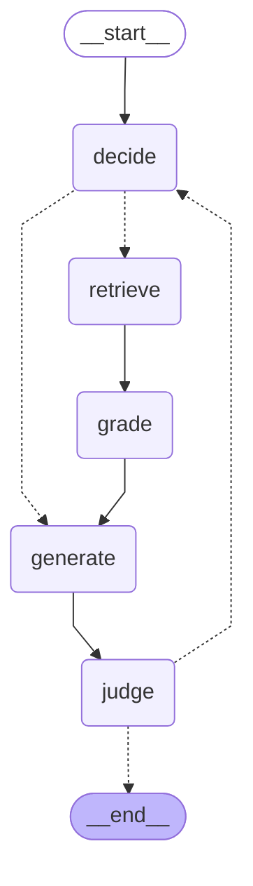

# Agent graph

Generated by `python -m agent.graph`.

```mermaid
---
config:
  flowchart:
    curve: linear
---
graph TD;
	__start__([<p>__start__</p>]):::first
	decide(decide)
	retrieve(retrieve)
	grade(grade)
	generate(generate)
	judge(judge)
	__end__([<p>__end__</p>]):::last
	__start__ --> decide;
	decide -.-> generate;
	decide -.-> retrieve;
	generate --> judge;
	grade --> generate;
	judge -.-> __end__;
	judge -.-> decide;
	retrieve --> grade;
	classDef default fill:#f2f0ff,line-height:1.2
	classDef first fill-opacity:0
	classDef last fill:#bfb6fc
```
