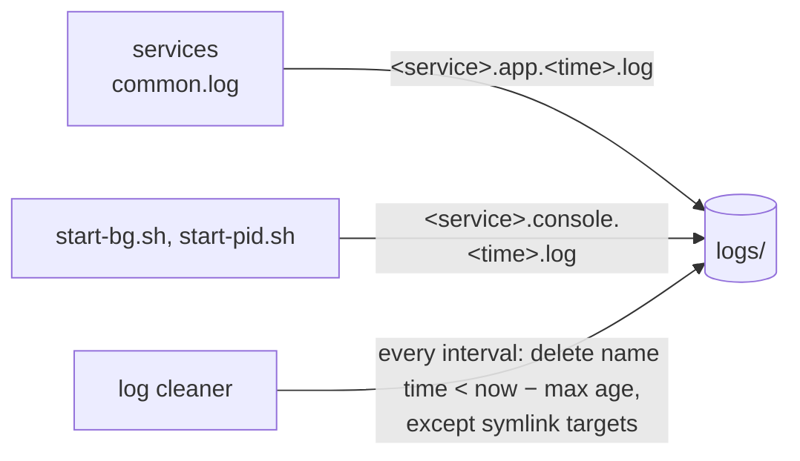

# common

Values and helpers shared by every service in `rag/`. Any service may import it; it imports no
service. Shared values are enums, not magic strings.

## Contents

- `common.stage`:
  - `Stage`: `development`, `staging`, `production`, read from the `STAGE` environment
    variable (default `development`). An unknown value stops the service at startup.
  - `load_env(path)`: loads the service's `.env` into the environment in development only.
    Other stages take config from the environment alone. Variables already set win over the
    file. `STAGE` itself must come from the real environment, never from `.env`.

- `common.collection`:
  - `Collection`: the note collections search indexes, each a top-level folder of the vault
    root: `ml` (machine-learning notes) and `test` (made-up facts about the user, for testing
    routing and retrieval). Search indexes these folders only; the agent routes a question to one.

- `common.log`: logging for every project. See [Logging](#logging).
- `common.log_cleaner`: a separate process that deletes old log files. See
  [Log cleaner](#log-cleaner).

## Logging

Every project logs through `common.log`, never the `logging` module directly:

```python
from common.log import get_logger
log = get_logger("search.sync")     # any module: <service>.<module>

from common.log import setup_logging
setup_logging("search")             # once, in the service's entry point
```

- Libraries (`llm`, `agent` as imported by a service, `observability`) only call `get_logger`;
  their lines go to the file of the service that runs them.
- Entry points today: `search/__main__.py`, `agent/__main__.py`, and
  `orchestrator/app.py` (the app module, so `just orchestrator dev` with `uvicorn --reload` gets it
  too). uvicorn is run with `log_config=None`, so its startup and access lines use this config.

Each line is `time LEVEL logger message` and goes to:

| Where | What |
|---|---|
| `logs/<service>.app.<creation time>.log` at the `rag/` root, e.g. `logs/orchestrator.app.2026-10-01T14-30-05.log` | Everything at or above `LOG_LEVEL`. A new file starts when the process starts, every `LOG_ROLL_MINUTES` and at `LOG_MAX_MB`. Old files are deleted by the [log cleaner](#log-cleaner) |
| `logs/<service>.log` | A symlink to the current file: `tail -F logs/search.log` follows it across rollovers |
| stderr | The same lines, unless `LOG_STDERR=false` |
| `logs/<service>.console.<creation time>.log` | Only for processes started in the background (`scripts/start-bg.sh`, `scripts/start-pid.sh`, which set `LOG_STDERR=false`): what bypasses logging, such as a crash before logging is set up. A new file at each start; `logs/<service>.console.log` is a symlink to it |

`httpx` and `httpcore` log at WARNING only (at INFO, httpx logs every request).

### Configuration

All logging and cleanup settings are in one class, `common.log.LoggingConfig`: its fields hold
the defaults below, and `LoggingConfig.from_env()` overrides each with its environment variable
if set. An invalid value stops the process at startup. `setup_logging(service)` uses
`LoggingConfig.from_env()`; pass `setup_logging(service, LoggingConfig(...))` to set it in code.

| Variable | Default | Meaning |
|---|---|---|
| `LOG_LEVEL` | `INFO` | `DEBUG`, `INFO`, `WARNING` or `ERROR` (`LogLevel`); anything else stops the service at startup |
| `LOG_DIR` | `logs/` at the `rag/` root | Where the files go |
| `LOG_ROLL_MINUTES` | `60` | Time per file. Roll times are counted from local midnight, so with 60 a new file starts at every full hour (`14:00`, `15:00`), with 15 at `:00`, `:15`, `:30`, `:45`. Midnight always starts a new file. Must be positive |
| `LOG_MAX_MB` | `50` | Size at which a new file starts, within the roll interval. Must be positive |
| `LOG_STDERR` | `true` | `false` writes the file only |
| `LOG_CLEANUP_MAX_AGE_HOURS` | `24` | [Log cleaner](#log-cleaner): files whose name time is older than this are deleted; `--max-age-hours` overrides it. Must be positive |
| `LOG_CLEANUP_INTERVAL_MINUTES` | `60` | Log cleaner: time between passes. Must be positive |

### File names

Every log file is named `<service>.<stream>.<creation time>.log`, where stream is `app` (written
through logging) or `console` (a background process's stdout and stderr) and the time is local,
`YYYY-MM-DDTHH-MM-SS`. The pattern is `common.log.FILE_NAME`, built by `common.log.file_name`;
the background scripts write console names in the same form. Symlinks (`<service>.log`,
`<service>.console.log`) and pid files do not match it.

## Log cleaner

`python -m common.log_cleaner` runs as its own process. Every `LOG_CLEANUP_INTERVAL_MINUTES`, it
deletes the files in `LOG_DIR` that match the file name pattern and whose name time is older than
now minus `LOG_CLEANUP_MAX_AGE_HOURS`. A file a symlink points to is being written and is kept
even if it is older. The root `just up` starts it in the background, and `just down` stops it.
It logs as `log-cleaner` (`logs/log-cleaner.log`). Its settings are in
[`LoggingConfig`](#configuration).



## Use

Add it as a path dependency in the service's `pyproject.toml`:

```toml
dependencies = ["common"]

[tool.uv.sources]
common = { path = "../common", editable = true }
```

## Commands

- `just test`: run the tests.
- `just log-cleaner-up` / `just log-cleaner-down`: start or stop the cleaner in the background
  (pid in `logs/log-cleaner.pid`). From the root: `just common log-cleaner-up`.
- `just log-cleaner`: run it in the foreground.
- `just log-clean`: one pass and exit, e.g. `just log-clean --max-age-hours 6`.
