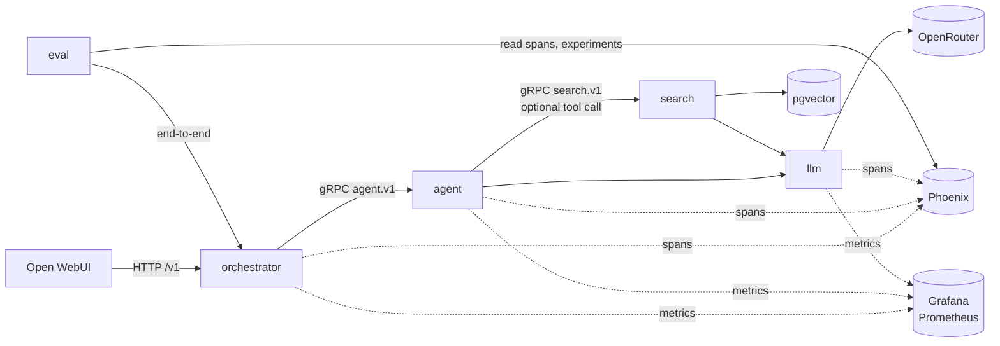
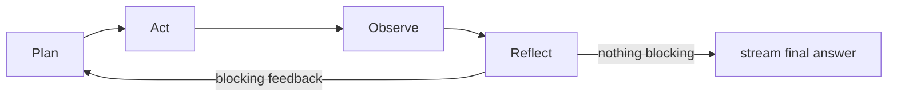

# Architecture

## Request flow



`search` does not send telemetry yet. Calls between services are gRPC, through clients generated
from the `.proto` contracts in `../proto/` ([ADR 0005](decisions/0005-grpc-generated-clients.md)).

## The agent loop



- **Plan:** decide whether to retrieve, and write the query. On a retry, with the verifier's
  feedback and the queries already tried, it may write a new query for what is missing.
- **Act:** run the search tool, grade the results for relevance, and produce the draft.
- **Observe:** put the result into graph state (plain code, no LLM).
- **Reflect:** run the verifiers and aggregate feedback.

The nodes as built (`decide`, `retrieve`, `grade`, `generate`, `judge`): `../agent/README.md`
and the generated graph in `../agent/graph.md`.

Hard limits on iterations and cost stop a runaway request. If hit, the best answer so far is
returned and the request is tagged with how it ended.

## Dependency rules

Solid arrows are Python imports (`[tool.uv.sources]` path dependencies); dashed arrows are
network calls, labelled with the protocol or contract.

```mermaid
flowchart LR
    webui[webui<br/>Open WebUI] -. HTTP /v1 .-> orchestrator
    orchestrator -. gRPC agent.v1 .-> agent
    agent -. gRPC search.v1 .-> search
    orchestrator & agent & search & eval --> contracts[contracts<br/>proto/]
    agent --> llm
    search --> llm
    search --> common
    llm -. HTTPS .-> openrouter[(OpenRouter)]
    search -. SQL .-> pg[(pgvector)]
    agent & llm & orchestrator --> observability
    orchestrator & agent & llm -. OTLP spans .-> phoenix[(Phoenix)]
    orchestrator & agent & llm -. OTLP metrics .-> grafana[(Grafana<br/>otel-lgtm)]
    eval --> orchestrator
    integration_tests --> orchestrator
```

- Dependencies only point one way. Each directory is a separate service or library, and no
  service imports another service's project. A caller imports only `contracts` (`../proto/`):
  the code generated from each service's `.proto` plus a thin wrapper per service
  (`contracts.search.SearchClient`, `contracts.agent.AgentClient`), and reaches the service over
  gRPC. The service implements the generated servicer. `eval` and `integration_tests` import the
  orchestrator's client and talk to the running orchestrator over HTTP.
- Only `llm/` talks to model providers, and only to OpenRouter: chat, and embeddings for now
  (moving to a local ONNX model in `search/` is planned; see `plan.md`).
- `common/` holds shared values (the `Stage` enum, `.env` loading). Any service may import
  it; it imports no service.
- `orchestrator/` knows HTTP and OpenAI's format; the agent knows only its gRPC contract.
  End-to-end runs in `eval/` go through the orchestrator (`OrchestratorClient`).

## What is a service

`search/` (gRPC, port 8001), `agent/` (gRPC, port 8002) and `orchestrator/` (HTTP, port 8000)
are services; `proto/` (`contracts`) and `llm/` are libraries; `eval/` is a command-line runner; `observability/` runs Phoenix and Grafana
and holds the shared telemetry helper (`setup_telemetry`). Whether any of this changes is
tracked in `plan.md`.
