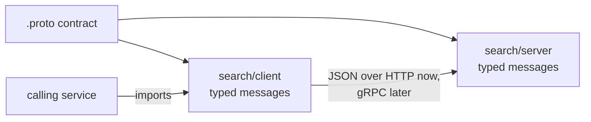

# 0001: Protobuf contracts, JSON over HTTP at first

- Status: accepted; the transport (JSON over HTTP) and the open details are superseded by
  [0005](0005-grpc-generated-clients.md)
- Date: 2026-09-29
- Scope: all services (cross-cutting)

## Context

The system is split into services, each with a `client/` (what other code imports to call it)
and a `server/` (the service itself). The contract between them needs to be explicit, typed and
documented in the repo. Services will need streaming (partial results from the agent). The
orchestrator's edge is fixed by Open WebUI: OpenAI-compatible HTTP and JSON. That edge is not
covered by this decision.

## Decision

- Service contracts are defined in protobuf (`.proto` files), including `service` and `rpc`
  blocks.
- At the start, messages are sent as JSON over plain HTTP, using protobuf's standard JSON
  mapping (`google.protobuf.json_format` in Python). Binary protobuf over gRPC can replace the
  transport later without changing the contracts.
- The JSON conversion lives inside each `client/` and `server/`. Callers only see typed
  messages, and no other code depends on the JSON shape.
- Streaming is SSE or newline-delimited JSON for now, using the same message types.

## Alternatives considered

- **FastAPI with pydantic and OpenAPI only.** Simpler, with contracts generated from code and
  automatic docs. Rejected because the contract would be defined by one implementation, not by a
  language-neutral schema, and moving to streaming RPC later would change the contracts.
- **gRPC with binary protobuf from the start.** Best typing and streaming, but harder to debug
  (no `curl`, traffic not readable) and more setup before anything works. Deferred, not rejected.
- **Connect (connectrpc):** serves the same `.proto` service over HTTP with JSON and over gRPC.
  Close to the intended path. Not evaluated yet; check its Python support and maturity before
  hand-writing the HTTP layer.

## Consequences

- Services can be called with `curl` and their traffic is readable while developing.
- Trace context keeps travelling in the plain `traceparent` HTTP header, so `telemetry.md` holds
  for now. If the transport moves to gRPC, it travels in gRPC metadata and that doc must change.
- The JSON mapping has quirks to handle in `client/` and `server/`:
  - field names are `lowerCamelCase` unless `preserving_proto_field_name=True`;
  - 64-bit integers are serialized as strings;
  - fields with default values are omitted unless requested (the option's name has changed
    between versions);
  - parsing rejects unknown fields unless `ignore_unknown_fields` is set;
  - `bytes` are base64 and timestamps have a fixed string format.
- FastAPI's automatic OpenAPI docs do not describe these endpoints, since the models are
  protobuf. The contract docs come from the `.proto` files.
- `service` and `rpc` blocks are written now, even though the HTTP layer is hand-written, so
  generating gRPC later is a transport change. Use one URL scheme that matches gRPC method
  naming, e.g. `POST /search.v1.Search/Query`.
- Generated code and the Python packages need a pinned, matching `protobuf` runtime and
  generator version.

## Open details (not yet decided)

- Where the `.proto` files live: a single `proto/` directory at the `rag/` root (proposed), or in
  each service.
- Whether generated code is checked in (proposed: yes, with a check that regeneration produces
  no diff) or built on demand.
- Whether to use `buf` for linting, breaking-change checks and generation.
- Connect versus a hand-written HTTP layer.
- Which services actually get a `server/` (see `plan.md`).
