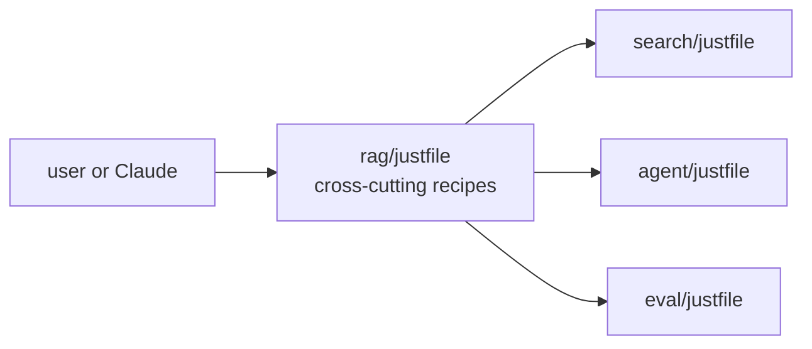
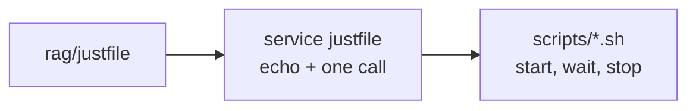

# 0002: `just` as the task runner

- Status: accepted
- Date: 2026-09-29
- Scope: all services (cross-cutting)

## Context

Each service has its own dependencies, tests and way of running, and the stack has several
moving parts (pgvector, Phoenix, the services, code generation). There needs to be one
documented command surface, so that neither the user nor Claude has to remember per-service
incantations.

## Decision

- `just` is the task runner for `rag/`.
- A `justfile` at the `rag/` root holds cross-cutting recipes (for example bringing the stack up,
  regenerating protobuf code, running all tests). Each service can have its own `justfile` for
  its own recipes (for example `sync`, `test`).
- Docs refer to `just <recipe>` as the way to run things, not to raw commands.

## Alternatives considered

- **make:** ubiquitous, but built for file targets, with awkward syntax and quoting for what are
  command aliases.
- **uv scripts or poethepoet:** tied to Python packaging, and each service already has its own
  `pyproject.toml`, so there is no single place for cross-service recipes.
- **Shell scripts in a `scripts/` directory:** no built-in listing, no arguments or dependencies
  between recipes.

## Consequences

- One extra tool to install (`brew install just` on macOS).
- `just --list` documents the available commands, and recipe comments show up in it.
- Recipes should orchestrate, not contain logic: real logic belongs in the service's code.
- Recipes read configuration from environment variables, consistent with `conventions.md`.

## Delegation to services

- The root `justfile` loads each service `justfile` with `mod <service>`, so its recipes run from
  the root as `just <service> <recipe>`. Module recipes run in the service's directory and load
  that service's `.env`. `mod` is stable from `just` 1.31; 1.58 is installed.

## Amendment (2026-10-01): shell logic lives in `scripts/`

Recipes held 10 to 15 lines of inline bash each to start a service and wait for it, which broke
"recipes should orchestrate, not contain logic", and the same polling loop was copied into five
services. That bash now lives in shared scripts at the root `scripts/`, and recipes echo and call
them:

| Script | Does | Used by |
|---|---|---|
| `start-bg.sh` | runs a command in the background (log in the root `logs/<name>.log`), waits for a health URL, fails if the process dies | `orchestrator up`, `search up` |
| `start-pid.sh` | runs a command that serves no port in the background, tracked by `logs/<name>.pid`; fails if it exits at startup | `common log-cleaner-up` |
| `stop-pid.sh` | stops a process started by `start-pid.sh` | `common log-cleaner-down` |
| `compose-up.sh` | `docker compose up -d`, waits for a health URL | `webui up`, `phoenix up`, `grafana start` |
| `compose-down.sh` | `docker compose down`, skipped when Docker is not running | every Docker service's `down` |
| `stop-port.sh` | stops whatever listens on a port and waits until it is free | `orchestrator down`, `search down` |
| `docker-desktop.sh` | `start` waits for the daemon; `stop` quits Docker Desktop unless other containers run | root `up` and `down` |

- `scripts/` is cross-cutting tooling, like the root `justfile` and `docs/`. A service justfile
  reaches it as `source_directory() / ".." / "scripts"`; this is the one place a service
  references something outside its directory, and only for dev tooling, never code.
- The scripts are generic: they take a name, URL, port or timeout as arguments and know nothing
  about any service. Service-specific values stay in the recipe.
- They are bash, the same bash that was inline in the recipes before. ADR 0003 (Python) covers
  services and libraries, not dev tooling, so it is not affected.
- The alternative, a copy of each script per service, keeps every directory self-contained but
  repeats the polling loop five times.

## Open details (not yet decided)

- The initial recipe list (candidates from `plan.md`: `sync`, `up`, `proto`, `test`).
- The minimum `just` version to require.
