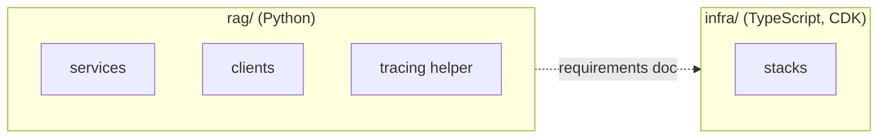

# 0003: Python for everything in `rag/`

- Status: accepted
- Date: 2026-09-29
- Scope: all services and libraries in `rag/`

## Context

`rag/` is a set of services and libraries (search, agent, orchestrator, eval, llm, the tracing
helper). The existing code (`langchain/`, `pytorch/`) is Python, and so are the tools the design
leans on: LangGraph, `boto3` for Bedrock, PyTorch, protobuf, Phoenix and its OpenTelemetry
instrumentation. The neighbouring `infra/` project is TypeScript (CDK).

## Decision

- Every service and library in `rag/` is written in Python: each `server/` and each `client/`.
- The shared tracing helper is Python and is imported by every service.
- `infra/` is not affected. It stays TypeScript with CDK. The two projects meet through documents
  such as `infra/ml-requirements.md`, not through shared code.

## Alternatives considered

- **TypeScript, to match `infra/`.** One language across the repo, but LangGraph, PyTorch,
  `boto3` and the Phoenix instrumentation are Python-first, and the existing code is Python.
- **A different language for some services (for example Go for the HTTP edge).** Faster
  services and cheap concurrency, but it splits the tooling, and the shared tracing helper and
  generated protobuf clients would need a version per language. Nothing in the design is
  bottlenecked on the service language, since the time goes into LLM calls.
- **A mix chosen per service.** Rejected for the same reasons as the previous option.

## Consequences

- One toolchain: one language for clients, servers, tests and evals. The `client/` and `server/`
  halves of a service share generated protobuf code directly.
- `eval/` can use the same libraries as the services, such as the Phoenix client and the
  protobuf clients.
- Python concurrency limits apply. `boto3` is blocking, so async servers must run Bedrock calls
  in a thread or use `aioboto3`. This is noted in `infra/ml-requirements.md`.
- A new language would need a new ADR that supersedes this one.

## Open details (not yet decided)

- Python version.
- Package and environment manager (for example a uv workspace, as `plan.md` suggests).
- Web framework for the HTTP layers.
- Test runner and lint/type-check tools.
