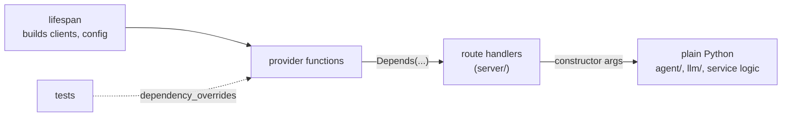

# 0004: FastAPI for HTTP layers, `Depends` for wiring

- Status: accepted; narrowed by [0005](0005-grpc-generated-clients.md): service-to-service
  calls are gRPC, so FastAPI serves only the orchestrator's OpenAI-compatible edge
- Date: 2026-09-29
- Scope: every HTTP server in `rag/` (the orchestrator's edge and each service's `server/`)

## Context

[0003](0003-python-for-all-services.md) left the web framework open. The orchestrator must serve
Open WebUI over OpenAI-compatible HTTP with streaming, and each service's `server/` exposes its
protobuf contract as JSON over HTTP ([0001](0001-protobuf-contracts-json-transport.md)). Servers
need shared, long-lived objects (clients for other services, the `llm/` client, config) wired
into request handlers, and tests need to swap them for fakes.

## Decision

- Every HTTP server is a FastAPI app, run with `uvicorn`.
- Wiring uses FastAPI's built-in `Depends`. No separate DI library.
- `Depends` stays in `server/`. Code below it (`agent/`, `llm/`, service logic) takes its
  dependencies as constructor arguments and never imports FastAPI, so `agent/` still does not
  know HTTP and `eval/` can build the same objects without a server.
- Long-lived objects are built once in the app's `lifespan` and handed out by small provider
  functions. Per-request resources use `yield` dependencies.
- Internal endpoints read the raw body and parse it with `google.protobuf.json_format`, as 0001
  requires. Pydantic models are used only at the orchestrator's OpenAI-compatible edge.

## Alternatives considered

- **Flask:** mature and simple, but sync-first, with no built-in DI or streaming story that
  matches FastAPI's.
- **Starlette alone:** what FastAPI is built on. Lighter, but it has no `Depends`, so the
  wiring would be rebuilt by hand.
- **Litestar:** comparable features and its own DI, but a smaller ecosystem and less
  OpenTelemetry and example coverage.
- **A DI library (`dependency-injector`, `injector`, `dishka`):** containers and scopes beyond
  one request, but `Depends` plus constructor injection covers what the servers need, and one
  less concept to learn. Revisit if wiring outside the servers (for example in `eval/`) gets
  painful.
- **Connect (connectrpc), open in 0001:** not chosen now. If adopted later, it replaces the
  hand-written internal endpoints and needs a new ADR that supersedes this one for those.

## Consequences

- One framework and one wiring style across servers. Tests replace dependencies with
  `app.dependency_overrides` instead of patching.
- Handlers stay thin: parse, call the plain-Python layer, serialize.
- FastAPI's generated OpenAPI docs are useful only at the orchestrator's edge; internal
  contracts are documented by the `.proto` files (as 0001 says).
- `boto3` is blocking. Handlers that reach it are plain `def` (FastAPI runs them in a thread
  pool) or the call is moved off the event loop, as 0003 notes.
- `opentelemetry-instrumentation-fastapi` reads the `traceparent` header, which fits
  `telemetry.md`.
- `Depends` only works inside a request. Anything run outside a server (`eval/`, scripts) wires
  its objects by hand, which is why the plain-Python layer must not rely on it.
