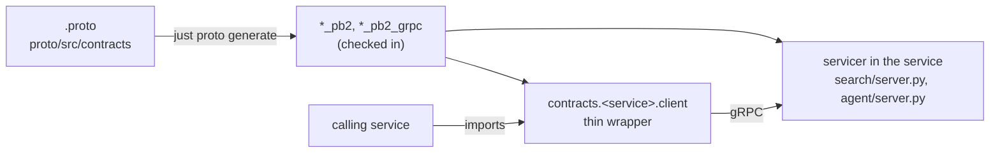

# 0005: gRPC between services, through clients generated from the `.proto` contracts

- Status: accepted
- Date: 2026-10-01
- Scope: every service-to-service call (search, agent); not the orchestrator's OpenAI-compatible edge
- Supersedes: the transport part of [0001](0001-protobuf-contracts-json-transport.md) (JSON over
  HTTP), and settles its open details

## Context

[0001](0001-protobuf-contracts-json-transport.md) made `.proto` files the contracts but sent JSON
over hand-written HTTP endpoints. In practice the `.proto` was documentation only: `search/`
served pydantic models, `search.client` parsed dicts into a dataclass, and nothing checked either
against the `.proto`. Callers depended on interfaces written by hand in Python, and on the
search project itself to get its client. The agent had no contract at all: the orchestrator
imported it as a library.

The rule wanted instead: every directory is a separate service, its interface is defined in
`.proto` only, and callers use a client generated from it. A thin hand-written wrapper over the
generated client is fine; a hand-written copy of the interface is not.

## Decision

- **Transport: gRPC**, with code generated by `grpcio-tools` (`protoc` with the Python and gRPC
  plugins), run through `uv`, so no extra machine tool is needed.
- **One contracts project, `proto/`** (Python package `contracts`). Each service's contract is
  `proto/src/contracts/<service>/v1/<service>.proto`, with the generated code next to it:
  `*_pb2.py` and `*_pb2.pyi` (messages), `*_pb2_grpc.py` (the client stub and the servicer base).
  The proto packages stay `search.v1` and `agent.v1`, so the RPC paths are
  `/search.v1.Search/Query` and `/agent.v1.Agent/Run`.
- **Generated code is checked in.** `just proto generate` writes it; `just proto check` (also run
  by `just proto test`) fails if it differs from what the `.proto` files generate.
- **Wrappers:** `contracts.<service>.client` holds a thin wrapper per service
  (`SearchClient`, `AgentClient`), configured through its constructor (address, timeout,
  interceptors, channel options). It fills in the address (`SEARCH_ADDRESS`, `AGENT_ADDRESS`),
  the deadline and the request message, and returns the generated messages as they are. Errors
  are the stub's `grpc.RpcError`; each caller maps them to its own `ServiceFault` where it models
  the failure.
- **Interceptors on our own request/response interface** (`contracts/interceptors.py`): every
  call is a `Request` (method, message, timeout, metadata, streaming) passed through the
  constructor's interceptors, each `intercept(request, proceed) -> Response`, to the stub.
  Cross-cutting behaviour lives there: `TraceContext` (always first) and `Retry`. Retries are
  switched on only for the agent's calls to search, which are read-only; a retried `Run` would
  pay for its model calls again.
- **Callers depend on `contracts` only**, never on another service's project. A server depends on
  `contracts` too and subclasses the generated servicer.
- **The agent is a service** (`python -m agent`, port 8002), not a library the orchestrator
  imports. `Run` is a server-streaming RPC: `Progress` events while the loop works, then one
  `Answer`.
- Status codes: INVALID_ARGUMENT for a malformed request (or a `UserError`), UNAVAILABLE for a
  `ServiceFault` (a dependency down), INTERNAL for anything else.
- Trace context travels in the call's metadata (`traceparent`). The `TraceContext` interceptor
  injects it; the server side is OpenTelemetry's gRPC server instrumentation, switched on by
  `setup_telemetry`.

## Alternatives considered

- **Keep JSON over HTTP (0001) and add a contract test.** Keeps `curl`, but the interface is
  still written by hand on both sides; the test only catches drift after the fact.
- **Connect (connectrpc).** Serves the same `.proto` as gRPC and JSON over HTTP from generated
  code, so `curl` would still work. Python support is younger and needs `buf` or a separate
  `protoc` plugin installed. Not rejected; worth another look if debugging gRPC gets painful.
- **Generated code inside each service's package** (e.g. `search.v1`). Then a caller would import
  the service's project to get its client, which is what this decision removes.
- **Instrumenting the gRPC client with OpenTelemetry.** Its streaming wrapper attaches the span's
  context inside a generator, and Starlette steps a streamed response from changing contexts, so
  the detach fails in the orchestrator. Injecting `traceparent` in an interceptor avoids it.
- **gRPC's own client interceptor API** (`grpc.UnaryUnaryClientInterceptor`, ...). One class per
  call shape, `ClientCallDetails` to rebuild, and tied to gRPC. Our interface is one method for
  unary and streaming calls and survives a transport change.
- **gRPC's retry policy in the service config.** Configured as JSON channel options, invisible in
  code and untestable without a server; `Retry` is plain Python with an injectable `sleep`.

## Consequences

- One source for each interface: changing a `.proto` changes the generated code on both sides,
  and `just proto check` catches a forgotten regeneration.
- No `curl` against internal services. Use the wrappers (`just search query "..."`), or install
  `grpcurl` if needed (not a requirement now; servers do not enable reflection).
- `scripts/start-bg.sh` waits for a gRPC service with a TCP probe (`tcp://host:port`); the
  servers bind only once they are ready (search after its sync).
- `just up` starts one more process (the agent), between search and the orchestrator.
- Messages are protobuf objects, not dataclasses: build them with keyword arguments; unset
  scalars read as their zero value (an unset `k` is 0, which the search service reads as 5).
- `grpcio`, `grpcio-tools` and `protobuf` versions must match: the generated code checks the
  runtime at import. `grpcio-tools` is pinned in `proto/pyproject.toml`.
- After a failed connection a gRPC channel waits before reconnecting (1 s rising to 120 s by
  default), and calls in that window fail at once. The wrappers' `DEFAULT_CHANNEL_OPTIONS` cut
  that to 0.1 to 1 s, so `Retry` reaches a restarted server.
- Search has no telemetry yet (see `plan.md`), so it does not continue the trace; the agent does.
