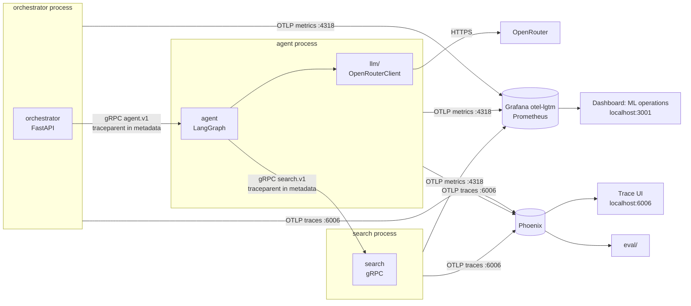

# Telemetry

How the system observes itself. Two signals, two stores, one helper:

- **Metrics** (request count, latency, error / fault / failure) go to **Grafana**, stored in
  Prometheus. They answer "how is it doing over time?".
- **Traces** (every step of one request: prompts, notes, judge scores) go to **Phoenix**. They
  answer "what happened in this request?", and are what `eval/` reads.

Every service sends both through the helper in `../observability/` (`setup_telemetry`), over
OTLP. The servers run in Docker from `../observability/phoenix/` and `../observability/grafana/`;
`just up` starts both.



## Outcomes

Every measured operation ends with exactly one outcome. The split says whose problem it is.

| Outcome | Meaning | Decided by | Example |
|---|---|---|---|
| `success` | It worked | No exception, status below 400 | An answer was returned |
| `error` | The caller's mistake | `UserError`, a 4xx status, or the caller going away mid-stream | Unknown route (404), wrong API key (401), bad body (422) |
| `fault` | A modelled service failure: one the code expects, names and handles | `ServiceFault` or a subclass, or a 5xx answered on purpose | OpenRouter answered an error (`OpenRouterError`), search unreachable (`SearchUnavailable`), the agent service down (`AgentUnavailable`) |
| `failure` | Anything unplanned | Any other exception | A bug: `KeyError`, `TypeError`, a crash |

A fault is a known failure mode with a name; turning a failure into a fault means adding a
`ServiceFault` subclass where it happens. A rising failure count means a bug or a failure mode
nobody has modelled yet. The orchestrator answers a `ServiceFault` with 503 in OpenAI's error
shape, so Open WebUI shows the message. Classification looks through exception causes and
groups, so a fault re-raised by a framework (e.g. Starlette, once a stream has started) still
counts as a fault.

## Metrics

Two instruments, shared by every service (`../observability/src/observability/metrics.py`):

| Instrument | Type | Prometheus name | Attributes |
|---|---|---|---|
| `ml.operations` | counter | `ml_operations_total` | `operation`, `outcome`, plus the operation's own |
| `ml.operation.duration` | histogram, seconds | `ml_operation_duration_seconds_{bucket,sum,count}` | the same |

Histogram buckets run from 5 ms to 10 min, because an agent run can take minutes.

### Service and pod on every series

`setup_telemetry(service, instance=None)` names the process once, on the OpenTelemetry resource
(`../observability/src/observability/resource.py`), so every metric and span it exports carries
it, ours and the instrumentation libraries' alike, with nothing passed at the call sites:

| Resource attribute | Value | Prometheus label |
|---|---|---|
| `service.name` | the service: `orchestrator`, `agent` | `job` (also `service_name`) |
| `service.instance.id` | the pod: `instance` if given, else `POD_NAME`, else the hostname | `instance` (also `service_instance_id`) |

In Kubernetes the hostname is the pod name, so nothing needs setting; set `POD_NAME` from the
downward API (`fieldRef: metadata.name`) to be explicit. Locally every process on the machine gets
the hostname, which is fine while each service runs once (`job` tells them apart); set `POD_NAME`
to run a second copy. Each pod is its own set of series; a replaced pod's series go stale and
age out with Prometheus retention. More attributes can be added with `OTEL_RESOURCE_ATTRIBUTES`;
they reach Prometheus in `target_info` only, not on every series.

### Operations

| Operation | Where | Extra attributes | Typical non-success |
|---|---|---|---|
| `orchestrator.http` | Every HTTP request to the orchestrator (`OutcomeMiddleware`), including the whole streamed body | `method`, `route` (template, `unmatched` for unknown paths) | error: 401, 404, 422; fault: 503 from a `ServiceFault`; failure: 500 |
| `agent.run` | One agent answer, all graph steps (`run` in `agent/graph.py`) | | fault: a model call or search failed |
| `llm.chat` | One model call through OpenRouter (`llm/src/llm/openrouter.py`) | `model` | fault: OpenRouter error or unreachable |
| `agent.search` | One query to the search service (`retrieve` in `agent/graph.py`) | | fault: unreachable or a gRPC error |
| `search.query` | One `Query` in the search service (`search/src/search/server.py`) | | error: an invalid request (`InvalidRequest`, answered INVALID_ARGUMENT); fault: the embedding failed |
| `search.sync` | One vault sync, at `just search sync` and before serving (`search/src/search/sync.py`) | | failure: the vault or the database is unreadable (a note that fails to embed is skipped, not raised) |

Operations nest: a failed model call counts once as an `llm.chat` fault, once as an
`agent.run` fault (in the agent process) and once as an `orchestrator.http` fault (the agent
answers UNAVAILABLE, the orchestrator raises `AgentUnavailable` and answers 503). Each level answers its own question.

Instrumentation libraries add standard metrics too: `http_server_request_duration_seconds`
(FastAPI) and `http_client_request_duration_seconds` (httpx). gRPC calls get spans, not metrics.

### Measuring a new operation

```python
from observability import ServiceFault, operation

class VaultLocked(ServiceFault):  # a named, expected failure: counted as a fault
    pass

with operation("search.sync", vault="ml"):  # or @operation("search.sync") on a function
    ...
```

Name operations `<service>.<thing>`. Keep attribute values to a small fixed set (model, route),
never ids or user text: each value combination is a separate Prometheus series.

### Timing a function

When only the run time matters (no outcome), decorate the function with `@timed(name)`
(`../observability/src/observability/timing.py`):

```python
from observability import timed

@timed("search.embed", model="bge-small")  # static attributes are optional
def embed(texts): ...
```

Every call records its wall time into one shared histogram, whatever the function:

| Instrument | Type | Prometheus name | Attributes |
|---|---|---|---|
| `ml.time` | histogram, seconds | `ml_time_seconds_{bucket,sum,count}` | `function` (the name given), plus the decorator's own |

It works on plain functions, `async def` (times the await), generators and async generators (the
whole iteration, until exhausted, raised or closed). A call that raises is timed too. Name it
`<service>.<thing>` like an operation; the name is given, not taken from the function, so a rename
keeps the series. Use `operation` instead when success and failure should be counted.

| Function | Where |
|---|---|
| `agent.decide`, `agent.retrieve`, `agent.grade`, `agent.generate`, `agent.judge` | Each graph node in `agent/graph.py`, one call per step |
| `search.embed`, `search.vector`, `search.bm25`, `search.fuse` | The steps of one search query in `search/server.py`: embed the query, vector ranking (pgvector), BM25 ranking, rank fusion |
| `orchestrator.answer` | The backend's whole answer to a non-streamed request (`orchestrator/backends.py`) |
| `orchestrator.stream` | A streamed answer, from the first piece until the last is sent or the stream fails (`orchestrator/backends.py`) |

## Dashboard

**ML operations**, at http://localhost:3001/d/ml-operations (Grafana login admin / admin). It is
code: `../observability/grafana/dashboard.py` builds it with the Grafana Foundation SDK and
uploads it with an HTTP `POST` to Grafana's API (how, and how to target another Grafana:
[`../observability/README.md#dashboard-upload`](../observability/README.md#dashboard-upload)). `just observability grafana up` uploads it on every start; after editing the script,
run `just observability grafana dashboard`. Changes made in the Grafana UI are overwritten, so
edit the script. The built JSON is kept in `../observability/grafana/dashboards/ml.json`.

The dashboard has `Service`, `Instance` (pod) and `Operation` filters at the top, and these rows:

| Row | Panels |
|---|---|
| Overview (selected time range) | Requests; success, error, fault and failure rate; p95 latency |
| Traffic | Requests per minute by outcome (stacked, colour per outcome); by operation |
| Latency | p50 / p95 / p99 per operation |
| Errors, faults, failures | One panel each, per operation |
| Function time | Calls per minute and p50 / p95 run time of `@timed` functions, per function (`Service` filter only) |

To query by hand: Grafana, **Explore**, data source **Prometheus**:

```promql
# requests per minute, by outcome
60 * sum by (outcome) (rate(ml_operations_total[5m]))

# fault rate of model calls
sum(rate(ml_operations_total{operation="llm.chat", outcome="fault"}[5m]))
  / sum(rate(ml_operations_total{operation="llm.chat"}[5m]))

# p95 latency per operation
histogram_quantile(0.95, sum by (le, operation) (rate(ml_operation_duration_seconds_bucket[5m])))
```

## Traces

- One request is one trace. The orchestrator's FastAPI instrumentation opens the root span; the
  agent's `/agent.v1.Agent/Run` span, its `agent` span and the graph steps are children.
  Services pass the trace on in the standard `traceparent` header: over HTTP the httpx
  instrumentation adds it; over gRPC the wrappers in `../proto/` (`contracts`) put it in the
  call's metadata and the server's gRPC instrumentation (from `setup_telemetry`) continues it.
  The gRPC client is not instrumented (see [ADR 0005](decisions/0005-grpc-generated-clients.md)).
- Each step is a span. Auto-instrumentation covers HTTP, LangChain and LangGraph spans;
  model calls get an LLM span by hand in `llm/` (see Model calls and cost). The attributes below
  are added by hand.
- Spans go to Phoenix, project `ml`. Keep every trace.

### Model calls and cost

Every model call is one OpenInference LLM span named `openrouter.chat`, opened by
`OpenRouterClient` in `../llm/`. It carries the standard OpenInference attributes, so Phoenix
shows the model, tokens and cost per call and adds them up per trace and per experiment:

| Attribute | Value |
|---|---|
| `openinference.span.kind` | `LLM` |
| `llm.model_name` | The model OpenRouter actually used, e.g. `anthropic/claude-haiku-4.5` |
| `llm.provider` | The vendor part of the model ID (`anthropic`, `openai`), when OpenInference knows it |
| `llm.token_count.prompt`, `.completion`, `.total` | Tokens, from OpenRouter's usage |
| `llm.token_count.prompt_details.cache_read`, `.cache_write`, `llm.token_count.completion_details.reasoning` | When OpenRouter reports them |
| `llm.cost.total` | USD that OpenRouter billed for the call (`usage.cost`) |
| `llm.cost.prompt`, `llm.cost.completion` | The upstream split, when OpenRouter reports it |
| `input.value`, `output.value` | The messages (JSON) and the answer |

The cost is OpenRouter's billed amount, not an estimate from a price table, so caching discounts
are included and nothing has to be kept up to date when prices change.

### Attributes we add

| Attribute | On | Meaning |
|---|---|---|
| `run.id` | every span | One experiment: a dataset plus a config, with many requests |
| `config.hash` | every span | Hash of the full config for the run |
| `config.<service>.*` | service root span | The config slice that service uses |
| `agent.iteration` | generate and judge spans | Which answer (1, 2, 3) the span is about |
| `agent.iterations` | agent root span | How many answers were written |
| `agent.termination_reason` | agent root span | `passed`, `iteration_limit` or `judge_unavailable` (the judge failed, so the answer was accepted unjudged); `budget` once cost limits exist |
| `agent.retrieval_skipped` | agent root span | Whether the agent answered without searching |
| `agent.retrieval_empty` | agent root span | The agent searched, but no note was relevant: the answer comes from general knowledge and says so |
| `agent.searches` | agent root span | How many searches ran (a retry may search again with a new query) |
| `agent.note_paths` | agent root span | The notes that went into the answer's context, after grading |
| `agent.needs_notes` | decide span | Whether decide asked for a search this round |
| `agent.route` | decide span | The collection decide routed to (`ml`, `test`), `none`, or `all` when its reply was unparseable and every collection is searched |
| `search.query` | decide and retrieve spans | The query the agent wrote |
| `search.collection` | retrieve span | The collection searched; empty for every collection |
| `search.note_paths` | retrieve span | Every note path search returned, before the floor and grading |
| `search.similarities` | retrieve span | Cosine similarity of every result, kept or not (for checking `AGENT_MIN_SIMILARITY`) |
| `search.kept`, `search.dropped` | retrieve span | Results at or above the similarity floor, and under it |
| `grade.relevant_paths`, `grade.rejected_paths` | grade span | The notes the grade step kept, and those it judged not relevant |
| `verifier.name` | verifier span (the agent's `judge` node) | Which verifier ran, e.g. `WordLimitJudge` |
| `verifier.passed` | verifier span | Result |
| `verifier.blocking` | verifier span | Whether failure forces another iteration |
| `verifier.feedback` | verifier span | The message for the LLM |
| `verifier.score` | verifier span | Judge score, 0-100 |

`run.id` and `config.*` are not emitted yet.

## Which services send what

| Service | Metrics | Traces |
|---|---|---|
| `orchestrator/` | `orchestrator.http`, FastAPI HTTP metrics; `ml.time` for the backend's answer | Root span per request |
| `agent/` | `agent.run`, `agent.search`; `ml.time` per graph node | gRPC server span per `Run`, `agent` span, graph nodes |
| `llm/` | `llm.chat` | One LLM span per model call, with tokens and cost |
| `search/` | `search.query`, `search.sync`; `ml.time` per query step | gRPC server span per `Query`, continuing the agent's trace |

A new service calls `setup_telemetry("<name>")` once at start; a gRPC service calls it before
building its server, and an HTTP service also calls `instrument_app(app, "<name>.http")`. Its tests set `TRACING_ENABLED=false` and
`METRICS_ENABLED=false` in `conftest.py`.

## Configuration

| Variable | Default | Meaning |
|---|---|---|
| `METRICS_ENABLED` | `true` | `false` turns metrics off (tests do this) |
| `METRICS_COLLECTOR_ENDPOINT` | `http://localhost:4318` | Grafana's OTLP over HTTP; `/v1/metrics` is appended |
| `METRICS_EXPORT_INTERVAL_MS` | `10000` | How often metrics are sent |
| `TRACING_ENABLED` | `true` | `false` turns tracing off (tests do this) |
| `PHOENIX_COLLECTOR_ENDPOINT` | `http://localhost:6006` | Phoenix; `/v1/traces` is appended |
| `PHOENIX_PROJECT_NAME` | `ml` | Phoenix project, one for every service |
| `POD_NAME` | the hostname | The pod, as `service.instance.id` (Prometheus `instance`) on every metric and span |

Ports and image tags of the two servers: `../observability/README.md`.

## Caveats

- If Grafana is not running, the metric exporter logs a warning at every export. Start it
  (`just observability up`) or set `METRICS_ENABLED=false`.
- Counters are cumulative per process. Prometheus misses the first increment of a series that
  appears with a value already above zero, so after a restart each new operation/outcome
  combination undercounts by one in `increase()` and `rate()`.
- Metrics carry no prompts or user text; traces do.

## Privacy

Spans contain prompts and note text. Phoenix runs locally. Decide a retention period, and give
Phoenix a persistent volume, or the audit trail is lost when the container is removed.
