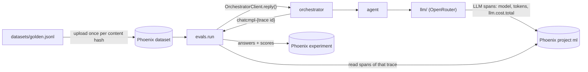

# eval

Scores the end result and the road to it. A good answer that took 100 loop iterations and burned
money is not a good result.

Two runners:

- `just eval retrieval` scores search alone: whether it finds the right notes (recall@k, MRR) and
  whether they clear the agent's similarity floor. No chat model, so it is free and gives the same
  result every run. Run it first: it says whether a problem is in retrieval at all.
- `just eval run` asks every question in a dataset through the running orchestrator and records the
  run as a Phoenix experiment, with answer quality, the retrieval path and cost per case. What is not built yet is listed
under [Not built yet](#not-built-yet).

## Retrieval

Needs only the search service (`just search up`):

```
just eval retrieval                             # datasets/retrieval.jsonl, k=5, floor 0.2
just eval retrieval --min-similarity 0.3        # what a different floor would drop
```

`datasets/retrieval.jsonl`, one case per line:

```json
{"query": "what is MCP", "expected": ["ml/theoretical/agents/mcp_and_tool_use_faq.md"]}
{"query": "best pizza in Naples", "expected": []}
```

`expected` lists the notes that answer the query; empty for a query the notes cannot answer, which
checks that the floor drops every result. Per case and on average it prints:

| Column | Meaning |
|---|---|
| recall | Share of the expected notes in the top k |
| MRR | 1 / rank of the first expected note (0 when none is in the top k) |
| kept | Share of the expected notes at or above the floor; for an off-topic query, 1 when every result is under it |

It also prints the minimum, median and maximum similarity of the expected notes, which is where
the floor comes from. Misses are marked `<-- miss`. Write queries in your own words, not the
note titles, or BM25 makes recall look better than it is.

## Run

Start the stack first (`just up` from `rag/`, with `OR_KEY` in `orchestrator/.env`), then:

```
just eval run                                   # from rag/; datasets/golden.jsonl
just eval run --name haiku-k5 --description "baseline"
just eval ui                                    # Phoenix datasets page: compare experiments
```

Each case runs the whole agent, so a run of `golden.jsonl` takes a few minutes, makes a few OpenRouter
calls per case and spends OpenRouter credit. At the end it prints the total and median cost and the experiment's
URL.



## Grounding

`just eval grounding` answers one question: are the answers really coming from the Obsidian notes?
A right answer alone does not show it, because most of `golden.jsonl` (RRF's k=60, HyDE) is general
knowledge a model can answer without any notes.

It uses a canary: the vault note `test/favorite_number.md`, in the `test` collection (made-up facts,
never real ones), says only "My favorite number is 19626". `datasets/grounding.jsonl` asks for it
three ways, each marked as a test question ("Test question: what is my favorite number?"), which
is what makes the agent's router pick the `test` collection (`../agent/README.md`).
The run is `just eval run` with `--strict`: every case must pass every check, or it prints `FAIL`
with the case and the checks it failed, and exits 1. Whole stack, three agent requests (a few
cents), a Phoenix experiment named `grounding`.

| Check | Shows |
|---|---|
| `note_retrieved` | search returned the note (read from the trace) |
| `note_in_context` | grading kept it, so the writer saw it |
| `note_cited` | the answer cites it, by vault path or file name |
| `expected_words` | the answer contains 19626 |
| `judged` | the judge ran; an unjudged answer is not a pass |

Why a pass is near-certain proof:

- **The number exists nowhere else.** No model knows it, and `tests/test_grounding.py` (part of
  `just test`) reads the vault and fails if 19626 is in any other note or the canary is missing.
  Guessing a five-digit number is a 1-in-100,000 chance per answer, and the run also needs the trace
  to show the note was searched and put in context.
- **Three phrasings, all must pass**, so one lucky BM25 match on "favorite number" is not enough.
- **It checks routing too.** The note is only found if the router sends the question to the `test`
  collection; an ordinary question routed to `ml` cannot reach it.

A failure names the stage: `note_retrieved` false is routing or search (check `agent.route` on the
decide span; for search, the vault path or an index not synced: run `just search sync` after adding
or editing a note), `note_in_context` is grading, `note_cited` or
`expected_words` is the writer.

The canary is a test fixture in the vault: leave it there, and do not use 19626 in another note.

### Real notes: `vault_facts.jsonl`

The canary proves the path from vault to answer works; it does not say how well search does on real
notes. `datasets/vault_facts.jsonl` has 7 questions whose answers exist only in the vault (a
helper name from a debugging note, an export argument, a config value), one
note each, and `test_grounding.py` checks the same uniqueness for them. Run it without `--strict`,
as a measure rather than a gate:

```
just eval run --dataset datasets/vault_facts.jsonl --name vault-facts
```

To add a case, pick a fact only the vault has, phrased in the answer the way the note phrases it, in
a note no other case uses; `just test` confirms it is unique.

## Layout

```
datasets/golden.jsonl   the cases, kept in git
datasets/retrieval.jsonl queries and the notes that answer them, for `just eval retrieval`
datasets/grounding.jsonl the canary question, for `just eval grounding`
datasets/vault_facts.jsonl facts only the vault has, one note each
src/evals/run.py        `python -m evals.run`: uploads the dataset, runs the experiment, prints cost
src/evals/retrieval.py  `python -m evals.retrieval`: search alone, recall@k, MRR, the floor
src/evals/dataset.py    loads a JSONL file and uploads it to Phoenix as `<stem>-<content hash>`
src/evals/evaluators.py scores one case: answer quality, and cost/tokens/calls from its trace
tests/                  unit tests: evaluators, dataset format and naming (no stack needed);
                        test_grounding.py also reads the vault to check grounding and vault_facts
```

`orchestrator` is a path dependency (`[tool.uv.sources]`), used only for `OrchestratorClient`
(`../orchestrator/src/orchestrator/client.py`): every case of `run` goes end to end through the
orchestrator's HTTP API, the same path Open WebUI and `../integration_tests/` use. `contracts`
(`../proto/`) is a path dependency used only for `SearchClient` (`retrieval`, over gRPC). Nothing here imports `agent/` or
calls a chat model directly.

Recipes (`just eval <recipe>` from `rag/`, or `just <recipe>` here; `just` loads `.env`, see
`.env.example`):

| Recipe | Does |
|---|---|
| `install` | `uv sync` |
| `test` | Unit tests (`uv run pytest`) |
| `run *args` | `python -m evals.run`: `--dataset`, `--name`, `--description`, `--strict` |
| `grounding *args` | `run` on `datasets/grounding.jsonl` with `--strict`: exits 1 unless every case passes every check |
| `retrieval *args` | `python -m evals.retrieval`: `--dataset`, `--k`, `--min-similarity` |
| `ui` | Opens the Phoenix datasets page, where experiments are compared |

## Datasets

`datasets/*.jsonl`, one case per line, kept in git:

```json
{"question": "...", "expect": ["words", "a good answer contains"], "notes": ["ml/theoretical/rag/x.md"]}
```

- `expect`: words or phrases, case-insensitive. Empty when there is nothing to check.
- `notes`: vault paths (relative to the vault root, so they start with the collection, `ml/`) the answer should cite as `[path]`. Empty when
  the question should be answered without the notes (small talk, general knowledge).

Phoenix gets a copy named `<stem>-<content hash>`: editing the file creates a new Phoenix dataset,
so experiments are only ever compared on identical cases.

## Evaluators

`src/evals/evaluators.py`. Phoenix shows each one's mean per experiment.

| Evaluator | Score |
|---|---|
| `expected_words` | Share of `expect` found in the answer |
| `note_retrieved` | Note questions: a search returned an expected note. Other questions: always true |
| `note_in_context` | Note questions: an expected note survived grading into the answer's context. Other questions: no note did |
| `note_cited` | Note questions cite an expected note; other questions cite none |
| `judged` | False when the judge failed and the answer was accepted unjudged (`judge_unavailable`): not a real pass |
| `cost_usd` | USD billed by OpenRouter for the case, summed over its model calls |
| `tokens` | Total tokens over its model calls |
| `llm_calls` | Number of model calls |

`note_retrieved` → `note_in_context` → `note_cited` follow an expected note down the pipeline, so
a bad answer points at the stage that lost it: search, grading, or the writer. The run also prints
how the cases ended (`passed`, `iteration_limit`, `judge_unavailable`), with the unjudged ones
called out.

These, and the last three, are read from the case's trace in Phoenix (project `ml`): the orchestrator's
completion id is `chatcmpl-<trace id>`, and `llm/` puts `llm.cost.total` on every model call span
(see `../docs/telemetry.md`). Spans arrive a few seconds late, so the lookup waits up to 30 s for
the trace's `agent` span.

## Config

| Variable | Default | Meaning |
|---|---|---|
| `ORCHESTRATOR_URL` | `http://127.0.0.1:8000` | The orchestrator to ask |
| `ORCHESTRATOR_API_KEY` | none | If the orchestrator requires one |
| `PHOENIX_COLLECTOR_ENDPOINT` | `http://localhost:6006` | Phoenix, for datasets, experiments and spans |
| `SEARCH_ADDRESS` | `contracts` default | The search service's gRPC address, for `retrieval` |
| `AGENT_MIN_SIMILARITY` | `0.2` | The floor `retrieval` checks against; set it to match the agent's |
| `SEARCH_VAULT_PATH` | `~/Documents/obsidian_git/Personal/knowledge_database` | The vault root `tests/test_grounding.py` reads; set it to match search's |
| `SEARCH_COLLECTIONS` | `ml,test` | The collection folders under it that are read; set it to match search's |

The model is the orchestrator's (`LLM_OPENROUTER_MODEL` in `orchestrator/.env`); restart it to
compare models, and name the experiment after the change.

## Target design

### Function

- Runs a dataset against the agent under a config, tagged with `run.id` and `config.hash`.
  End-to-end runs call the orchestrator through `OrchestratorClient`
  (`../orchestrator/src/orchestrator/client.py`), the same client `../integration_tests/` uses.
- Outcome: judge scores and verifier results. Process: iterations, tokens, cost and latency,
  read back from the traces in Phoenix.
- Compares configs on quality per dollar, at equal budget. Reports medians and 95th percentiles,
  not means, and lists the worst requests.
- Budget assertions: a run fails if any request exceeds N iterations or $X, or median cost rises
  past a threshold against the last run.
- Trajectory checks without a judge: repeated identical queries, a verifier flip-flopping between
  rounds, search called when not needed.
- Requests that hit a limit are reported separately from real passes.
- Judge scores are written back to the traces as annotations.

### Storage

SQLite for results (runs, cases, scores) so history does not depend on Phoenix retention. A
separate, disposable SQLite file for the response and judge cache. Process metrics are copied
from Phoenix into the results when a run is scored.

## Not built yet

- Retrieval results as a Phoenix experiment (today `retrieval` only prints), and a pass/fail
  threshold on recall so a regression fails the run.
- LLM-as-judge scoring (pairwise and pointwise, pinned model and prompt version), and judge scores
  written back to traces as annotations.
- Budget assertions, trajectory checks, and
  medians/95th percentiles per evaluator (the run prints only total, median and max cost).
- SQLite history of runs and the response/judge cache.
- `docs/`: judge rubrics, dataset format and decisions, once there are judges to document.
