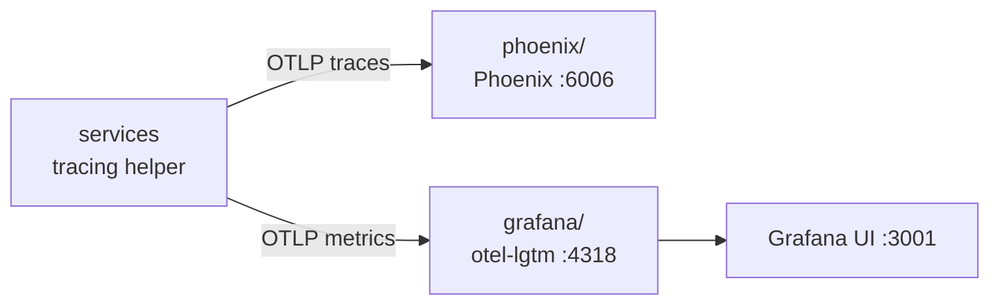
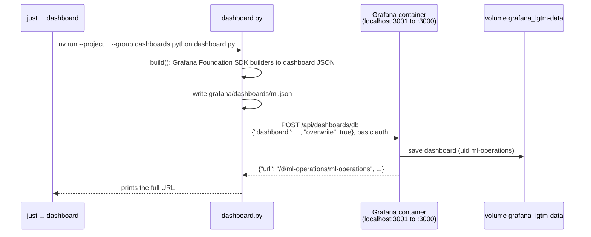

# observability

Runs the telemetry servers and holds the tracing helper every service imports.

Two servers, each a separate Docker project in its own subdirectory:

| Subdirectory | Server | For | UI |
|---|---|---|---|
| `phoenix/` | Arize Phoenix | LLM traces: prompts, tokens, graph steps; evals and datasets later | http://localhost:6006 |
| `grafana/` | Grafana `otel-lgtm` (Collector, Prometheus, Tempo, Loki, Pyroscope, Grafana) | Metrics dashboards: request counts, latency percentiles, error rates | http://localhost:3001 (admin / admin) |

Both are part of the stack: `just observability up` (and so the root `just up`) starts them, and
Grafana's start uploads the **ML operations** dashboard. How the whole system uses them (outcomes,
metric names, operations, the dashboard): [`../docs/telemetry.md`](../docs/telemetry.md).



Status: both servers run in Docker. The orchestrator, the agent, search and `llm/` send metrics
and traces through the helper (`src/observability/`). Every chat request is one trace in the
Phoenix project `ml`:

- **orchestrator:** `setup_telemetry` and `instrument_app`, so a span and the
  `orchestrator.http` operation per HTTP request; the backend's answer timed (`@timed`).
- **agent:** an `agent` span per run (with LangGraph's spans under it from the LangChain
  instrumentation), the `agent.run` and `agent.search` operations, and each graph node timed.
- **search:** `setup_telemetry("search")` before the server is built, so a span per `Query`
  under the agent's; the `search.query` and `search.sync` operations, and each query step timed.
- **llm:** an `openrouter.chat` span and the `llm.chat` operation per model call. It is a
  library and does not call `setup_telemetry`; the process that imports it (the agent) does.

## Run

From the `rag/` root (or drop `just observability` when inside `observability/`):

```
just observability up              # Phoenix and Grafana, what the root `just up` runs
just observability down            # stops Phoenix and Grafana; volumes are kept

just observability phoenix up      # http://localhost:6006
just observability phoenix logs
just observability phoenix reset   # deletes the volume and every trace

just observability grafana up      # http://localhost:3001, uploads the dashboard
just observability grafana dashboard  # rebuild and upload the dashboard after editing dashboard.py
just observability grafana logs
just observability grafana reset   # deletes the volume: metrics, traces, logs, dashboards
```

Each subdirectory's `justfile` is a module of `observability/justfile` and runs in that
subdirectory, so `docker compose` picks up its `compose.yaml` (and a `.env` there, if any).
Docker Desktop must be running (see `../docs/requirements.md`).

## Config

| Variable | Default | Meaning |
|---|---|---|
| `PHOENIX_PORT` | `6006` | Host port for the UI and OTLP over HTTP |
| `PHOENIX_GRPC_PORT` | `4317` | Host port for OTLP over gRPC |
| `PHOENIX_IMAGE_TAG` | `latest` | Phoenix image tag; pin a release to avoid surprise upgrades |
| `GRAFANA_PORT` | `3001` | Host port for the Grafana UI (3000 is Open WebUI's) |
| `LGTM_OTLP_GRPC_PORT` | `4319` | Host port for Grafana's OTLP over gRPC (4317 is Phoenix's) |
| `LGTM_OTLP_HTTP_PORT` | `4318` | Host port for Grafana's OTLP over HTTP |
| `LGTM_IMAGE_TAG` | `latest` | `grafana/otel-lgtm` image tag |
| `PHOENIX_COLLECTOR_ENDPOINT` | `http://localhost:6006` | Read by the tracing helper: where services send spans (`/v1/traces` is appended) |
| `PHOENIX_PROJECT_NAME` | `ml` | Read by the tracing helper: Phoenix project, one for every service |
| `TRACING_ENABLED` | `true` | Read by the tracing helper: `false` turns tracing off (tests do this) |
| `METRICS_ENABLED` | `true` | Read by the helper: `false` turns metrics off (tests do this) |
| `METRICS_COLLECTOR_ENDPOINT` | `http://localhost:4318` | Read by the helper: where metrics go (`/v1/metrics` is appended) |
| `METRICS_EXPORT_INTERVAL_MS` | `10000` | Read by the helper: how often metrics are sent |
| `POD_NAME` | the hostname | Read by the helper: the pod, `service.instance.id` on every metric and span (Prometheus `instance`) |

Services send spans to `PHOENIX_COLLECTOR_ENDPOINT`: `http://localhost:6006` from the host,
`http://host.docker.internal:6006` from another container.

## Function

- **Phoenix server:** `phoenix/compose.yaml`. Receives spans, stores traces, serves the UI. Data
  is in the named volume `observability_phoenix-data` (SQLite in `PHOENIX_WORKING_DIR`; the name
  is kept from before the move into `phoenix/`), so it survives
  `just down` and container removal; only `just reset` deletes it. Postgres is a probable option
  later (`PHOENIX_SQL_DATABASE_URL`).
- **Grafana server:** `grafana/compose.yaml`, the all-in-one `grafana/otel-lgtm` image for
  development. Its Collector takes OTLP on 4318 (HTTP) and 4319 (gRPC) and stores metrics in
  Prometheus, traces in Tempo, logs in Loki; Grafana has those as data sources already. Data is
  in the named volume `grafana_lgtm-data`; only `just observability grafana reset` deletes it.
  Services send metrics to `METRICS_COLLECTOR_ENDPOINT` (default `http://localhost:4318`).
- **Dashboard:** `grafana/dashboard.py` builds **ML operations** and uploads it to Grafana. See
  [Dashboard upload](#dashboard-upload) below.
- **Telemetry helper:** `setup_telemetry(service, instance=None)` once per process: it names the
  service and the pod (`resource.py`: `service.name` and `service.instance.id`, the `job` and
  `instance` labels on every series), then tracing (below), metrics
  (`metrics.py`: `ml.operations` and `ml.operation.duration` with an outcome of success, error,
  fault or failure, exported to Grafana) and httpx instrumentation. `instrument_app(app, name)`
  adds a span and the operation metrics per HTTP request. `operation(name)` measures any block or
  function; raise `ServiceFault` for a modelled failure, `UserError` for the caller's mistake.
  `@timed(name)` (`timing.py`) records only the run time of any function (plain, `async`,
  generator) into the shared `ml.time` histogram, with `function` = `name`.
- **Tracing helper:** `from observability import setup_tracing, tracer`. `setup_tracing()` runs
  once per process (later calls do nothing): it registers a global OpenTelemetry tracer provider
  with Phoenix's `phoenix.otel.register`, exporting over OTLP/HTTP in batches, and turns on
  OpenInference's LangChain instrumentation, which traces LangGraph graphs and their nodes.
  `tracer(name)` gives a tracer for manual spans (no-ops until tracing is set up).
- Attribute names are the contract between services: see `../docs/telemetry.md`.

## Dashboard upload

The **ML operations** dashboard is code, `grafana/dashboard.py`, and is pushed to the Grafana
container over Grafana's HTTP API. Nothing is mounted into the container and Grafana does not need
a restart.

```
just observability grafana dashboard            # build, write dashboards/ml.json, upload
just observability grafana dashboard --dry-run  # build and write only
```

`just observability grafana up` runs the same recipe once Grafana is healthy, so every start
uploads the current dashboard.



- **Build:** `build()` uses the Grafana Foundation SDK (`grafana-foundation-sdk`, in the
  `dashboards` dependency group of this project) to assemble panels and PromQL queries, then
  serialises them to the dashboard JSON model.
- **Upload:** `upload()` sends one HTTP `POST` to `$GRAFANA_URL/api/dashboards/db` with Python's
  standard `urllib` (no extra dependency), logging in with basic auth. Docker forwards host port
  3001 to Grafana's port 3000 inside the container (`grafana/compose.yaml`).
- **Replace, not duplicate:** the dashboard has a fixed uid, `ml-operations`, and the request sets
  `overwrite: true`, so each upload replaces the stored dashboard. Edits made in the Grafana UI
  are lost on the next upload: change `dashboard.py` instead.
- **Stored:** Grafana keeps the dashboard in its database on the named volume
  `grafana_lgtm-data`, so it survives restarts; `just observability grafana reset` deletes it
  (the next `up` uploads it again).
- **Other Grafana:** the API is the same for any Grafana. Point the upload elsewhere with:

| Variable | Default | Meaning |
|---|---|---|
| `GRAFANA_URL` | `http://localhost:$GRAFANA_PORT` (3001) | Grafana to upload to |
| `GRAFANA_USER` | `admin` | Basic-auth user |
| `GRAFANA_PASSWORD` | `admin` | Basic-auth password |

The alternative, Grafana's file provisioning (mounting `dashboards/ml.json` into the container),
was not used: it needs a restart or a reload to pick up changes, and the image's provisioning
paths would have to be overridden.

## Open

- Whether an ingest step (OpenTelemetry Collector or a custom service) sits between the
  services and Phoenix, to queue spans and handle spikes.
- Retention period for traces.
- Pinning `PHOENIX_IMAGE_TAG` and `LGTM_IMAGE_TAG` to releases.
- Metrics and traces for `search/`.
