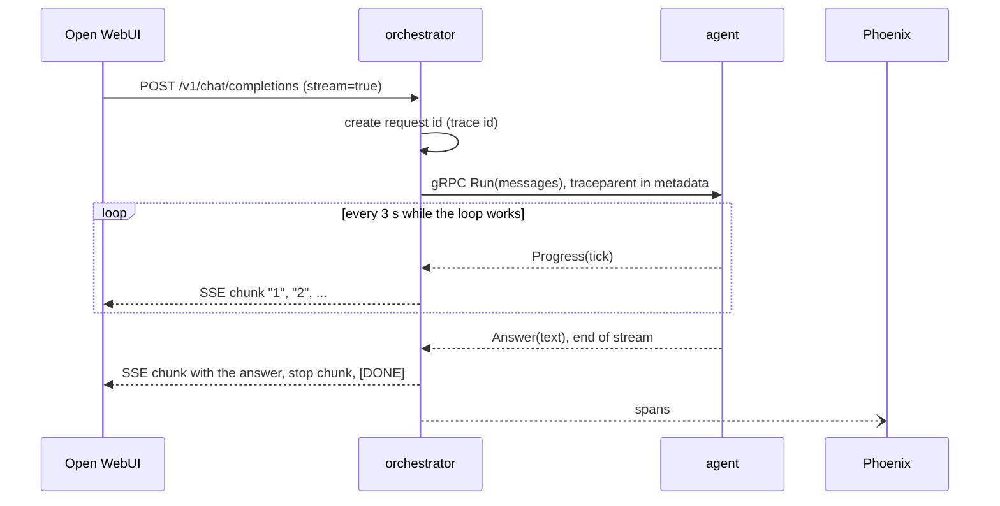

# Contract

Status: both edges are built: the Open WebUI edge (`src/orchestrator/app.py`) and the agent
edge (`src/orchestrator/clients/agent_client.py`, over gRPC).

The orchestrator has two edges with different contracts.

| Edge | Protocol | Defined by |
|---|---|---|
| Open WebUI → orchestrator | OpenAI-compatible HTTP and JSON | The OpenAI API (fixed by Open WebUI) |
| orchestrator → agent | gRPC, `agent.v1.Agent` | `../../proto/src/contracts/agent/v1/agent.proto`, see `../../docs/decisions/0005-grpc-generated-clients.md` |

ADR 0005 does not cover the first edge: Open WebUI expects OpenAI's format, so it stays
OpenAI-compatible HTTP whatever the internal transport is.

## Request flow



## Open WebUI edge

### `GET /healthz`

Liveness only: `{"status": "ok"}` while the process serves requests. Needs no API key and checks
no dependency (search, OpenRouter). `just up` waits on it.

### Errors

A `ServiceFault` from the backend (a dependency is down) is answered 503 with OpenAI's error body:

```json
{"error": {"message": "search is down", "type": "service_unavailable", "code": "ServiceFault"}}
```

Every route except `/healthz` answers 401 if `ORCHESTRATOR_API_KEY` is set and the request does
not send `Authorization: Bearer <key>`.

### `GET /v1/models`

Returns the routes as models. Each route is one entry.

```json
{"object": "list", "data": [{"id": "personal-rag-v0.1", "object": "model", "created": 0, "owned_by": "ml"}]}
```

Proposed route ids (not decided): `personal-rag-v0.1` (the orchestrated loop), and one raw route per model
being compared, so a comparison can be run from the UI.

Current: one route, `personal-rag-v0.1` (`ROUTE` in `src/orchestrator/schemas.py`). Whether the agent or a stub answers it is a deployment setting
(`ORCHESTRATOR_BACKEND`, see `config.md`), not a route.

### `POST /v1/chat/completions`

Request: the standard OpenAI chat body. `model` selects the route. `messages` carries the full
conversation history, because Open WebUI sends it with every request and the orchestrator holds
no conversation state.

Non-streaming response: a `chat.completion` object with `choices[].message`.

Streaming (`stream: true`): server-sent events. Each event is `data: <json>` with a
`chat.completion.chunk` object whose `choices[0].delta` carries the next piece, then a final
chunk with `finish_reason: "stop"`, then `data: [DONE]`.

If the backend fails after the stream started (the status, 200, is already sent), the stream
ends with an error event in the same shape as the 503 body, then `data: [DONE]`, with no stop
chunk. Any other exception is reported as
`{"error": {"message": "internal server error", "type": "server_error", "code": "<exception class>"}}`.

```
data: {"id":"...","object":"chat.completion.chunk","model":"personal-rag-v0.1","choices":[{"index":0,"delta":{"role":"assistant"},"finish_reason":null}]}
data: {"id":"...","object":"chat.completion.chunk","model":"personal-rag-v0.1","choices":[{"index":0,"delta":{"content":"Hello"},"finish_reason":null}]}
data: {"id":"...","object":"chat.completion.chunk","model":"personal-rag-v0.1","choices":[{"index":0,"delta":{},"finish_reason":"stop"}]}
data: [DONE]
```

Streaming rules:

- Only the final answer is streamed. Intermediate drafts from the agent loop never reach the
  user.
- The agent loop takes several LLM calls, so time to first token is long. While it works the
  agent streams a counter (`1`, `2`, `3`, ... one every 3 seconds), then the answer.
- If the agent hits its iteration or cost limit, the best answer so far is streamed. How that is
  shown to the user is undecided.

### Request id

The orchestrator creates the request id, which is the trace id, and passes it downstream. See
`../../docs/telemetry.md`.
The completion `id` (and every streamed chunk's `id`) is `chatcmpl-<trace id>`, 32 hex digits,
so a caller can look the request up in Phoenix.

## Agent edge

`agent.v1.Agent/Run` (`../../proto/src/contracts/agent/v1/agent.proto`), called through the
generated client wrapped by `contracts.agent.AgentClient` (`AGENT_ADDRESS`, default
`127.0.0.1:8002`, deadline 600 s). `AgentBackend` adapts it to the `Backend` protocol:

- Request: the OpenAI messages become `Message(role, content)`. `system` and `developer` map to
  `ROLE_SYSTEM`, `user` and `assistant` to theirs; other roles (e.g. `tool`) are left out.
  Multi-part content keeps only its text parts, joined by newlines. The request id is not a
  field: it is the trace id, carried in the call's metadata (`traceparent`).
- Response: a stream of `Progress` events, then one `Answer`. Streaming sends `"<tick>\n"` per
  progress event and then the answer (after a newline if any tick was sent); non-streaming
  returns the answer only.
- Errors: UNAVAILABLE (the agent is down, or reports search or OpenRouter down) and
  DEADLINE_EXCEEDED raise `AgentUnavailable`, a `ServiceFault`, answered 503 (or an error event
  mid-stream). Any other status is raised as `grpc.RpcError`: a failure, answered 500.
- If Open WebUI goes away mid-stream, closing the stream cancels the call. The agent's worker
  thread still finishes the run.

## Open questions

- How a limit-hit answer is presented.
- Route ids and which raw models are exposed.
- Whether this service merges into `agent/`, if there is only ever one agent.
