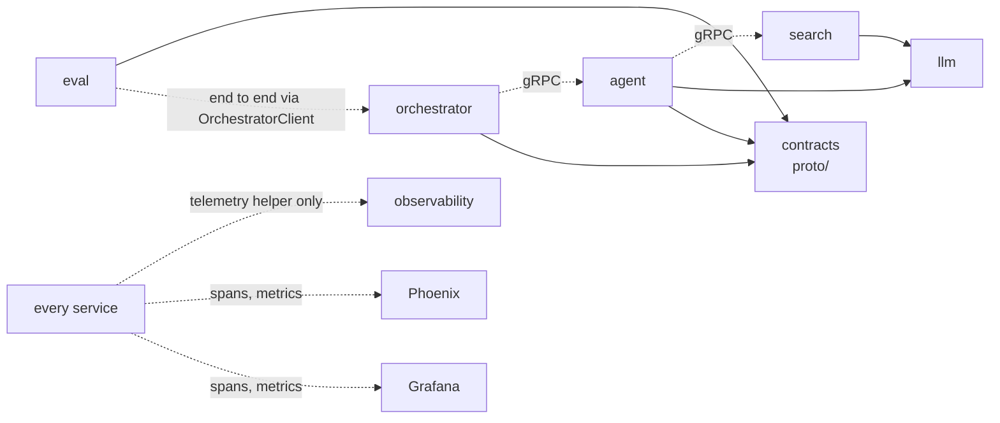
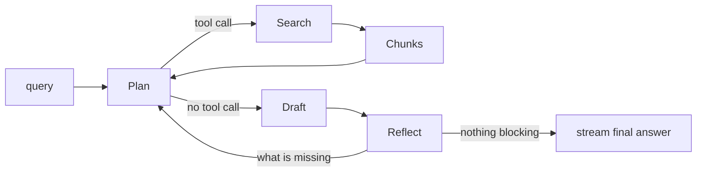

# ML monorepo plan

Status: the first slice is built and runs end to end (updated 2026-10-01). Done items are marked
**Done**; the rest are ideas and open decisions. Review findings still open are listed under
"Deferred from the 2026-10-01 review" below.

## Goal

A personal backend for Open WebUI. The orchestrator is the service Open WebUI connects to.
It answers a query directly, or retrieves from my Obsidian notes when it needs to, and loops
with LangGraph until an evaluator judges the answer good enough. Evals cover each layer.

## Structure

One directory per subsystem, each with its own `pyproject.toml` and `tests/`.

```
rag/
├── README.md         # human entry point, links into docs/
├── CLAUDE.md         # hard rules for Claude, points to docs/
├── plan.md           # this file
├── docs/             # system knowledge: architecture, conventions, setup, decisions/
├── llm/              # client layer: chat, stream, embed; provider-agnostic
├── search/           # ingest, embed, store (pgvector), query. RAG retrieval = this.
├── agent/            # Plan → Act → Observe → Reflect loop (LangGraph)
│   ├── graph.py      # the loop: retrieve (search tool), answer, judge
│   └── judges/       # pluggable verifiers (programmatic + LLM judge)
├── proto/            # contracts: .proto per service, generated gRPC code, client wrappers
├── orchestrator/     # the backend Open WebUI connects to; thin
│                     # /v1/chat/completions (SSE), /v1/models; backends: agent or stub
├── observability/    # phoenix/ and grafana/ (compose files) + shared telemetry helper
├── common/           # shared values (Stage enum, .env loading)
├── integration_tests/# smoke test of the running stack
└── eval/             # datasets, evaluators, runner (Phoenix experiments)
```

Dependencies go one way, never back:



- No subsystem imports a provider SDK directly. Only `llm/` does.
- `tests/` = pass/fail correctness. `eval/` = quality scores over time.
- `orchestrator/` knows HTTP, `agent/` knows only its gRPC contract. End-to-end runs in `eval/`
  go through the orchestrator (`OrchestratorClient`).
- **Done:** services talk only through gRPC clients generated from `.proto` contracts in
  `proto/` ([ADR 0005](docs/decisions/0005-grpc-generated-clients.md)).
  Full graph, imports versus network calls: `docs/architecture.md`.
- Open question: if there is only ever one agent, merge `orchestrator/server/` into `agent/`.
- `main.py` at the top level: move into a subsystem or delete.
- **Done:** dev task runner (`justfile`) at the root: `just <service> test`, `just up`, `just down`.
  A root `just test`/`check` across projects is still open (see below).

## Services

Each directory has one function and usually runs as its own service. Then the arrows above are
network calls between services, not Python imports, and each directory needs:

- Its own `pyproject.toml`, `Dockerfile` and entry point, plus a `docker-compose` at the `rag/`
  root and a task runner command to bring the whole stack up (`just up`). **Done** without a
  root compose: `just up` calls each service's `up` in order (see `README.md`).
- A written contract for its interface. The contract is the public API. Nothing reaches into
  another service's code. **Done:** a `.proto` per service in `proto/`, served over gRPC, called
  through the generated client (ADR 0005).
- Config and secrets via environment variables.

Decided so far (2026-10-01): every directory is treated as a separate service; `search/`,
`agent/` and `orchestrator/` run as their own processes. Libraries: `llm/`, `common/`,
`observability/`'s helper, `proto/` (`contracts`). The original lean, for the record:

- `search/`: service. Owns pgvector and the costly sync, and should keep running while the
  rest is restarted, which was the reason for pgvector in the first place.
- `orchestrator/`: service (what Open WebUI connects to).
- `agent/`: service or library called by the orchestrator. **Done:** a gRPC service
  (`agent.v1.Agent`, port 8002).
- `llm/`: library first. A gateway service (LiteLLM-style) only if several services need
  shared keys, rate limits or cost tracking.
- `eval/`: a CLI/runner that calls the others over their contracts, not a long-running service.

Trade-off: service boundaries give independent restarts and clear contracts, but cost
serialization, network failure handling, version drift between services and more to run
locally. Use a boundary where the lifecycle differs, and keep shared code as a library.

## Orchestrator flow



- Retrieval is optional. The agent decides by calling the search tool or not.
  The tool description must say what the notes contain and when to use them.
- The tool returns retrieved chunks + source paths only. The orchestrator's LLM writes the answer.
- Hard limits: max iterations and a token/cost budget. Return best answer so far if hit.
- Evaluator: concrete threshold (e.g. rubric score >= 4/5), structured output, pinned model,
  different (ideally stronger) model than the drafter. Rubric depends on the path taken:
  faithfulness to chunks if retrieval ran, correctness/helpfulness if not.
- Feed the evaluator's "what is missing" back as a more specific query. Track queries already tried.
  **Done:** a failed judge sends the run back to `decide`, which may search again.
- Stream only the final pass (or short status updates). Never intermediate drafts.
- Per request, emit spans for: tool called or not, query written, iterations, tokens, time.
  See "Observability".
- Stateless: Open WebUI sends the full history each request.
- Do not import `eval/` from the orchestrator. Share a rubric, not code.
- `/v1/models` lists the backends, which are only `agent` and `stub` (`BackendName`). No raw-model
  routes.
- Watch out: Open WebUI sends auxiliary requests (titles, tags, follow-ups, autocomplete)
  through the model unless a task model is set. Point its task model at a plain cheap route,
  or bypass the graph for those in `server/`. Verify against the running version.
- Turn off Open WebUI's built-in RAG so it does not run in parallel.

## Agent cycle: Plan → Act → Observe → Reflect

The orchestrator's loop follows this four-step cycle. Mapping (one graph node per step):

- **Plan:** the agent LLM decides whether to retrieve, and writes the search query or the
  answer approach. Its input includes the previous round's aggregated feedback.
- **Act:** run the search tool, or produce the draft answer.
- **Observe:** normalize the result into graph state: retrieved chunks, source paths, path
  taken, queries already tried, the draft. Plain code, no LLM.
- **Reflect:** run the verifiers, aggregate feedback. If nothing blocking fails, stream the
  final answer; otherwise the feedback goes back to Plan.

Keeping Observe as its own node means Reflect and the logs read from one consistent state.

## Verifiers (pluggable)

- Every verifier has the same interface: `applies(ctx)` and `verify(ctx) -> Verdict`
  (`passed`, `blocking`, `feedback` written for the LLM, `score`, `cost`).
- Programmatic verifiers (e.g. answer too long → error message asking the LLM to shorten) and
  LLM-judge verifiers sit in one configurable list per route.
- Each loop: filter by `applies`, run programmatic ones first in parallel, run judges only if
  no blocking programmatic failure, aggregate feedback into one block, add to context, go back
  to the agent step. Stop when nothing blocking fails or the limits are hit.
- Keep only the latest round's feedback plus a one-line summary of earlier rounds.
- A crashed verifier or malformed judge output is logged and skipped, not sent as feedback.
- Programmatic priority over judge advice when feedback conflicts.
- Early programmatic verifiers: length, non-empty, cited paths were in the retrieved set,
  valid format, no system-prompt leak, language matches.
- Verifiers live in `agent/verifiers/` so runtime gating and offline scoring in `eval/` can
  share code. This only works if `eval/` imports them. If `agent/` runs as a separate service,
  either publish `verifiers` as a small shared library package, or have `eval/` call the
  agent's endpoint and score there. See "Services" above.

## Observability (Phoenix, OpenTelemetry)

No Kafka. Phoenix (self-hosted, open source) is the store and UI for traces. Check details
against the current docs; everything below is from memory.

- Request id = trace id. The orchestrator creates it; services pass it on with the standard
  `traceparent` header (HTTP framework instrumentation does this). Every step is a span.
- Observers are small OpenTelemetry span emitters with our own attributes on top of the
  automatic ones. Call them "emitters" or "probes" in `docs/`, since "Observe" is already a
  node in the agent cycle. The agent's Observe node is the natural place to create spans.
- Auto-instrumentation (OpenInference): LangChain/LangGraph give graph spans. OpenRouter chat
  calls are written by hand in `llm/` as OpenInference LLM spans with token counts
  (`openrouter.chat`); embeddings (OpenRouter today, local ONNX later) are not measured yet.
- Attribute names are the contract between services; document them in `docs/`:
  `run.id`, `config.hash` and the config slice each service uses, `agent.iteration`,
  `agent.termination_reason` (passed / iteration limit / budget), verifier name, passed,
  blocking, feedback, the search query written, note paths returned, whether retrieval was skipped.
- `run.id` is separate from the trace id: a run is one experiment (dataset + config), with
  many requests in it. This is what lets configs be compared.
- **Done:** shared `setup_telemetry(service_name)` helper in `observability/` (see
  `docs/telemetry.md`). Used by `orchestrator/`, `agent/` and `llm/`; `search/` does not use it yet.
- Cost comes from token counts and Phoenix's model pricing table; OpenRouter model IDs may
  need custom pricing entries.
- Keep every trace (personal volume). Audit trail = all traces. Spend on the expensive parts
  (judge calls) for a subset. Tail sampling ("always keep failures") would need an
  OpenTelemetry Collector; a later addition.
- **Done:** Phoenix is a service: compose file in `observability/phoenix/`. Grafana (`otel-lgtm`, metrics dashboards, optional) is in `observability/grafana/`. Default storage is SQLite; it can
  probably use Postgres (a separate database in the pgvector instance). Persistent volume,
  or the audit trail is lost on `docker compose down`.
- Traces contain prompts and note text. Stays local; decide a retention period.
- Idea, undecided: a small ingest service between the emitters and Phoenix, acting as a cheap
  broker. It queues incoming spans/events (absorbs spikes such as a parallel eval run, and
  survives Phoenix restarts) and has an engine that builds a per-request aggregate (tools used,
  tokens, weaknesses found, config slice). Do not call it "sync": `just sync` already means the
  vault sync in `search/`. Options: an OpenTelemetry Collector (batching, memory limits, a
  persistent queue, tail sampling that groups spans by trace id) or a custom service. Open
  question: build the aggregate as events arrive, or on demand at eval time from Phoenix.

## Build order

### P1: semantic search over Obsidian notes

**Done**, with changes: search is hybrid (BM25 + vector, fused with RRF), and the sync is
incremental by content hash and embedding model. Chunking is still deferred.

- One vector per note, no chunking (deferred to P2).
- pgvector in Docker (compose file in `search/`), named volume so vectors survive restarts.
- Sync: read vault → strip frontmatter → embed → upsert. Incremental via content hash:
  embed only new/changed notes, delete rows for removed notes. Unchanged vault = no embedding calls.
- Sync is its own command (`just search sync`); startup calls the same command.
- Table: `notes(path PK, content_hash, embedding vector(N), model, token_count, truncated, updated_at)`.
  Stored `model` lets the sync re-embed everything when the model changes.
- Exact cosine search, no ANN index yet (add HNSW if slow).
- Vault path and DB connection string are env vars. Vault is read-only, never written by `rag/`.
- Embed title + body. Keep wikilink text (`[[x]]` → `x`).
- Log token count per note, flag truncated notes.
- Eval from day one: ~20 hand-written queries with expected note(s). Recall@k and MRR.
- Subsystems touched: `llm/` (embeddings), `search/`, `eval/`.

### P2 and later

- Chunking, as a module in `search/ingest/`.
- **Done:** `orchestrator/`: server with SSE streaming, behind Open WebUI (`webui/`); the
  agent + judge loop; search as a tool.
- Answer-quality evals: faithfulness and relevance, separate from retrieval evals.
- Evaluate the retrieve-or-not decision: dataset with queries that need notes and ones that do not.

## LLM layer and model comparison

- `llm/` wraps providers behind one interface. Roles in config: `generator`, `judge`, `embedder`.
- **Done:** OpenRouter for chat (`OpenRouterClient`, Haiku by default), one key in
  `OR_KEY`. Embeddings also go through OpenRouter today, until the local ONNX move
  (see "Embeddings"). Bedrock (Converse via `boto3`), the Claude CLI and Ollama were tried and
  removed.
- Compare two cheap models through OpenRouter. Pick two different families, not two sizes of
  one. Check current prices and tool-use support.
- Same dataset, prompts, parameters (low temperature). Record settings in each run.
- Log input/output tokens and latency per call. Compare quality per dollar.
- Cache responses keyed on model + prompt + params.
- Start with ~20 cases.

## Embeddings

**Decided direction (not built yet):** `search/` embeds locally with an ONNX model, for both
notes and queries, instead of calling OpenRouter. Note text then stays on the machine.

Open for the ONNX move:

- Which ONNX model (dimensions, input limit, quality on the eval set against today's model).
- Where the runtime lives: in `search/`, or in `llm/` behind `llm.embed` (the "only `llm/` talks
  to model providers" rule was written for hosted providers; decide and record it as an ADR).
- Re-embedding the vault (the stored `model` column makes the sync redo every note) and
  recalibrating `MIN_SIMILARITY` in `agent/` for the new model's similarity range.

Today (until the ONNX move):

- Hosted, through OpenRouter's embeddings API (`llm.embed`), the same key as chat. This sends
  note text to the hosted provider.
- Default `openai/text-embedding-3-small` (1536 dims, 8191-token input). pgvector stays in
  Docker; the `vector` column has no fixed dimension, and a model change re-embeds everything.
- No chunking in P1, so the model's input limit matters: notes at or over it are flagged as
  truncated (`LLM_EMBED_MAX_TOKENS`).

## Eval and LLM-as-judge

- `eval/`: `datasets/`, `metrics/`, `judges/`, `runners/`, `reports/`.
- Pairwise mode for comparing models (swap A/B and count a win only if both orders agree).
  Pointwise mode with a rubric for tracking over time and faithfulness.
- One criterion per rubric. JSON output with reasoning before score, validated.
  Temperature 0, pin model ID and prompt version, store both with each run.
- Judge is never one of the candidates. Give it reference answers where they exist.
- Check the judge against ~20 hand-labeled cases, keep them as a permanent judge test set,
  and re-run when the judge model or prompt changes.
- Cache judge calls. Start with pairwise for the model comparison.
- Retrieval evals are deterministic (recall@k, MRR) and come first. **Done:** `just eval retrieval`
  (`eval/datasets/retrieval.jsonl`), and `note_retrieved` / `note_in_context` in `just eval run`.
- **Done (first slice):** `just eval run` asks each question in `eval/datasets/golden.jsonl`
  through the running orchestrator and records a Phoenix experiment with answer quality and cost
  per case. Retrieval metrics (recall@k, MRR) and the other modes above are not built yet.

### Outcome and process, together

`eval/` scores the end result and also the road to it. A great answer that took 100 loop
iterations and burned money is not a good result. Outcome comes from judges and verifiers;
process comes from the Phoenix traces (pull spans into a dataframe with the Phoenix client,
join to scores; verify the current client API). Judge scores are written back to the trace as
annotations, so both sit on one record.

- Quality per dollar: plot judge score against cost per config. Compare on that frontier.
- Report medians and 95th percentiles of iterations and cost, not means. List the worst
  requests so their traces can be opened.
- Budget assertions as pass/fail: a run fails if any request exceeds N iterations or $X, or
  if median cost rises more than some percentage over the last run.
- Trajectory checks, programmatic, no judge: same query searched twice; a verifier flipped
  (pass, fail, pass) between rounds; iterations up while verifier score is not; search called
  when the query did not need it.
- Tag how each request ended. A request that hit a limit returns "best so far" and is reported
  separately from real passes.
- Compare configs at equal budget (same iteration/cost cap).
- Track judge cost in the same stream, tagged as eval cost, so it is not confused with the
  cost of the system under test.
- The runtime iteration/cost limits in the agent are the live guard; eval shows how close
  requests come to them. Neither replaces the other.
- Phoenix has its own evals, datasets and experiments. To keep one source of truth: datasets,
  verifiers and judges stay in this repo as code. Phoenix stores, shows and annotates traces
  (and maybe compares experiment runs). Move more into Phoenix later if it earns it.

## Open decisions

Record each as a short ADR in `docs/decisions/` once made.

Blocks P1:

- Embedding model: decided to move to a local ONNX model in `search/`; which model, where the
  runtime lives, and the re-embed plus `MIN_SIMILARITY` recalibration are open (see
  "Embeddings"). Today's default is `openai/text-embedding-3-small` via OpenRouter.
- Eval set for search: ~20 hand-written queries with expected notes.
- **Done:** which parts are services: `search/`, `agent/` and `orchestrator/` (ADR 0005).
- Whether Open WebUI Pipelines/Functions would be simpler than a separate backend.

Blocks agent and orchestrator (P2):

- **Done:** `agent/` is a gRPC service the orchestrator calls through the generated client
  (it was a library the orchestrator imported). Still open: whether the orchestrator merges
  into it.
- How `eval/` reuses the verifiers: import, shared library, or call the agent's endpoint.
- Streaming: final pass only, or status updates while looping.
- Evaluator threshold. **Done:** the LLM judge runs on Sonnet (`AGENT_JUDGE_MODEL`), the writer on Haiku.
- Open WebUI auxiliary requests: task model or bypass. Turn off its built-in RAG.

Blocks the model comparison:

- Which two OpenRouter models (both must support tool use), what the comparison is about (chat,
  RAG answers, tool use), and the judge model (neither candidate).

Observability:

- Phoenix storage (SQLite or Postgres) and retention.
- Which of datasets/evals/experiments live in Phoenix versus `eval/`.
- How to measure OpenRouter embedding calls (`llm.embed`); chat calls already have spans.
- Keep every trace (leaning yes) or add tail sampling later.

Housekeeping:

- `llm/`: library or gateway service.
- Eval runs: by hand or automatic on every change.
- What to do with `main.py` (PyCharm's sample; delete). `langchain/` was deleted: `agent/`
  replaced it.

## Deferred from the 2026-10-01 review

Still open from the repo review of 2026-10-01:

- Search telemetry: `setup_telemetry` and `operation("search.query"/"search.sync")` in `search/`,
  plus an `llm.embed` operation in `llm/`.
- Classify disconnects and cancellation (`asyncio.CancelledError`) as errors, not failures.
- Token and cost metrics: a dashboard panel for OpenRouter tokens and cost per request.
- **Done:** `proto/` drift: code is generated from the `.proto` files, and `just proto check`
  fails on stale generated code; ADR 0005 supersedes 0001's transport.
- **Done:** the search client is out of the `search` package (`contracts.search.SearchClient`).
- Run `just proto check` in CI once CI exists.
- A connection pool for search's database access.
- Chunking long notes.
- **Done:** `MIN_SIMILARITY` recalibrated for `text-embedding-3-small` with `just eval retrieval`:
  now a 0.2 junk floor, and a grade step (LLM) decides relevance. Re-run after the ONNX move.
- Structured-output support in `llm/` for the LLM judge.
- A root `just test` and `just check` across projects, and CI.
- Document the `.env` pairing (the orchestrator key shared by `webui/` and `orchestrator/`).
- Pin the Phoenix, Grafana and Prometheus image tags.

## Outside `rag/`

- Deploying the orchestrator, any self-hosted inference or managed vector store, and their IAM
  belong in `infra/`.
