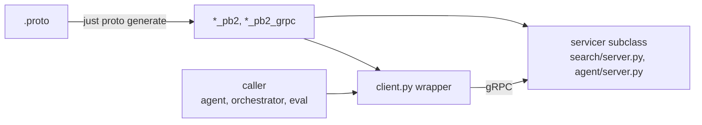
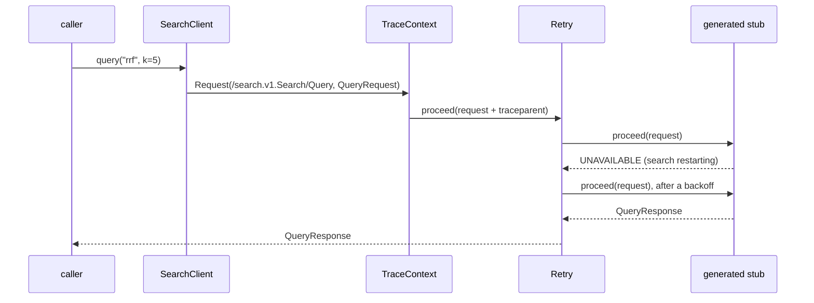

# proto (`contracts`)

The interfaces between services, defined once in `.proto`, and the gRPC code generated from
them. Every caller talks to a service through this package, never through the service's own
project. Why: [ADR 0005](../docs/decisions/0005-grpc-generated-clients.md).

Status: two contracts, both served.

| Contract | Served by | Address (env) | Wrapper |
|---|---|---|---|
| `search.v1.Search` (`Query`) | `search/` | `SEARCH_ADDRESS`, default `127.0.0.1:8001` | `contracts.search.SearchClient` |
| `agent.v1.Agent` (`Run`, server streaming) | `agent/` | `AGENT_ADDRESS`, default `127.0.0.1:8002` | `contracts.agent.AgentClient` |

The `.proto` files are the documentation of each contract: fields, defaults and status codes are
described in their comments.

## Layout

```
src/contracts/
  interceptors.py          Request/Interceptor interface, bind(), TraceContext, Retry, make_channel
  search/
    client.py              SearchClient: thin wrapper over the generated stub
    v1/search.proto        the contract
    v1/search_pb2.py, .pyi messages     (generated, do not edit)
    v1/search_pb2_grpc.py  SearchStub, SearchServicer (generated, do not edit)
  agent/
    client.py              AgentClient
    v1/agent.proto
    v1/agent_pb2.py, .pyi, agent_pb2_grpc.py
tests/test_clients.py      the wrappers against an in-process gRPC server
```

## How it is used



- A **caller** imports the wrapper (`from contracts.search import SearchClient`) and the
  generated messages (`from contracts.search.v1.search_pb2 import Result`). The wrapper is
  configured through its constructor, `SearchClient(address=None, *, timeout=30, interceptors=[],
  options=[])`, and only fills in the address, deadline and request message; it returns the
  generated messages and raises the stub's `grpc.RpcError`. The caller maps errors to its own
  `ServiceFault` where it models them (e.g. the agent's `SearchUnavailable`).
- A **service** subclasses the generated servicer (`search_pb2_grpc.SearchServicer`) and
  reports errors with `context.abort(code, details)`: INVALID_ARGUMENT for a bad request,
  UNAVAILABLE for a dependency down, INTERNAL for anything else.
- Trace context goes in the call's metadata (`traceparent`, injected by the `TraceContext`
  interceptor every wrapper puts first); the server's gRPC instrumentation from `setup_telemetry`
  continues the trace.

## Interceptors

Behaviour that applies to calls rather than to one method (retries, auth, logging) is an
interceptor, written against our own request/response interface in `interceptors.py`, not gRPC's:

```python
class LogCalls:
    def intercept(self, request: Request, proceed: Handler) -> Response:
        log.info("calling %s", request.method)       # e.g. "/search.v1.Search/Query"
        return proceed(request)                       # or request.replace(metadata=...)

client = SearchClient(interceptors=[Retry(max_attempts=3), LogCalls()])
```

- `Request`: `method`, `message` (the generated request), `timeout`, `metadata`, `streaming`.
  Frozen; change it with `request.replace(...)`.
- `Response`: the generated response message, or for a streaming RPC an iterator of them
  (errors are raised while iterating).
- Order: `TraceContext` first, then the constructor's interceptors, outermost first.
- `Retry(max_attempts=3, codes=(UNAVAILABLE,), initial_backoff=0.2, max_backoff=2.0)`:
  exponential backoff with jitter; a stream is retried only before its first message. Used only
  on the agent's search client: a search is read-only, while a retried agent `Run` would pay for
  its model calls again.



## Changing a contract

1. Edit the `.proto`. Add fields with new numbers; never reuse or renumber one. A breaking change
   gets a new version package (`v2/`).
2. `just proto generate` and commit the generated files with the `.proto`.
3. Update the service's servicer and every caller in the same change.
4. `just proto test` runs `check` (fails if the generated code is stale) and the wrapper tests.

Generation uses `grpcio-tools` (pinned in `pyproject.toml`, installed by `uv`), so no `protoc` or
`buf` install is needed. The generated code checks the installed `grpcio` and `protobuf` versions
at import, so they must not fall below the generator's.

## Calling a service by hand

There is no `curl` for gRPC. Use the wrappers, e.g. `just search query "rrf"`. `grpcurl` works
only with the `.proto` files passed in (`-import-path proto/src -proto contracts/search/v1/search.proto`),
since the servers do not enable reflection; it is not a machine requirement.
